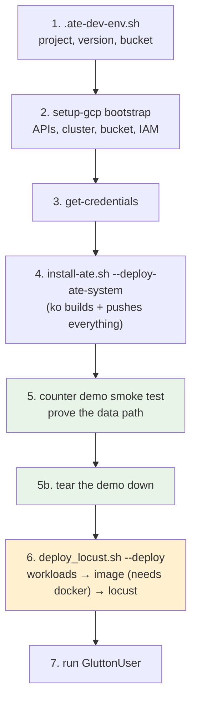

# Running the Scale Test on GKE

Step-by-step setup for a fresh GCP project, from nothing to a running
`GluttonUser` load test.

If you don't yet know what Locust, boomer, or glutton are, read
[ONBOARDING.md](ONBOARDING.md) first — this document assumes it. For the
operational reference (all deploy flags, the automation CronJob), see
[README.md](README.md).

---

## Why GKE and not kind

kind is fine for the counter demo and the inner dev loop, but the benchmark
needs three things it can't provide:

- [workloads/deploy.sh](workloads/deploy.sh) hard-requires `BUCKET_NAME` — actor
  snapshots go to GCS.
- The locust image is pushed to Artifact Registry.
- [automation/tests.yaml](automation/tests.yaml) targets GKE clusters
  (`targetCluster: dev`).

Use GKE.

---

## Prerequisites

| Requirement | Check |
|---|---|
| `gcloud`, authenticated | `gcloud auth list` |
| Application Default Credentials | `gcloud auth application-default login --project=$PROJECT_ID` |
| Go (matching root `go.mod`) | `go version` |
| `kubectl` within one minor of the cluster | `kubectl version --client` |
| `jq` (used by demo teardown) | `jq --version` |
| A container runtime — Docker, colima, podman | `docker version` |
| Project Owner or Editor on the target project | — |

Two notes on that list:

**`ko` needs no container runtime.** It builds and pushes OCI images directly.
Everything in steps 2–5 works without Docker. The *only* step that needs a
runtime is [locust/build_and_push.sh](locust/build_and_push.sh), which
`deploy_locust.sh` invokes in step 6 and which shells out to `docker build`.

**kubectl skew is real.** Kubernetes supports ±1 minor between client and
server. A 1.28 client against a 1.36 cluster will fail in confusing ways.

---

## Setup flow



---

## Step 1 — Environment file

```bash
cp hack/ate-dev-env.sh.example .ate-dev-env.sh
```

Edit these:

```bash
export PROJECT_ID=<your-project>
export CLUSTER_VERSION=1.36.2-gke.2064000
export NODE_POOL_VERSION=1.36.2-gke.2064000
export BUCKET_NAME=snapshot-substrate-test-${PROJECT_ID}
```

> ⚠️ **The example file pins a dead version.**
> [hack/ate-dev-env.sh.example](../hack/ate-dev-env.sh.example) ships with
> `CLUSTER_VERSION=1.35.5-gke.1163012`, which is no longer offered in
> `us-central1-c`. Cluster creation fails outright. Confirm what's actually
> available:
>
> ```bash
> gcloud container get-server-config --zone=us-central1-c \
>   --format="value(validMasterVersions)" | tr ';' '\n' | head
> ```
>
> [automation/README.md](automation/README.md) requires 1.36+, so pick a 1.36.x.

Then:

```bash
source .ate-dev-env.sh
```

## Step 2 — Provision GCP resources

```bash
go run ./tools/setup-gcp bootstrap
```

Takes 10–15 minutes and is idempotent — re-run it if it fails partway. It
performs:

| Stage | Result |
|---|---|
| `enable apis` | container, storage, logging, monitoring, trace, telemetry |
| `create cluster` | GKE `substrate-poc`, 2 × `c3-standard-4`, Workload Identity, managed OTel |
| `create bucket` | GCS bucket for actor snapshots |
| `create iam` | Workload Identity bindings for `atelet`, AR reader for nodes |
| `create dashboards` | Cloud Monitoring dashboards |

The cluster is created with two beta APIs enabled
([cluster.go:34-37](../tools/setup-gcp/cmd/cluster.go#L34-L37)):

```
certificates.k8s.io/v1beta1/podcertificaterequests
certificates.k8s.io/v1beta1/clustertrustbundles
```

Substrate depends on both — that's the reason for the version floor.

> **Artifact Registry.** `setup-gcp` does not enable
> `artifactregistry.googleapis.com` or create a repo. If AR and Container
> Registry APIs are already on for your project, the first `ko` push
> auto-creates the `gcr.io` repo in location `us`. If not:
>
> ```bash
> gcloud services enable artifactregistry.googleapis.com
> ```

## Step 3 — Cluster credentials

```bash
gcloud container clusters get-credentials substrate-poc \
  --zone "${CLUSTER_LOCATION}" --project "${PROJECT_ID}"

kubectl get nodes
```

## Step 4 — Install the substrate

```bash
./hack/install-ate.sh --deploy-ate-system
```

Builds every substrate image with `ko`, pushes to `${KO_DOCKER_REPO}`, and
deploys Valkey (in-cluster StatefulSet), `ateapi`, `atelet`, `atecontroller`,
and `atenet`. **The first run is slow** — it compiles the whole monorepo.

```bash
kubectl get pods -n ate-system      # all Running before continuing
```

## Step 5 — Smoke test the data path

Do not skip this. Thirty seconds here saves an hour of debugging a load test
that was never going to work. It exercises exactly the path described in §6–7 of
[ONBOARDING.md](ONBOARDING.md): Envoy → ext_proc → ateapi → worker.

```bash
go install ./cmd/kubectl-ate

kubectl ate create atespace default
./hack/install-ate.sh --deploy-demo-counter
kubectl ate create actor my-counter-1 -a default --template ate-demo-counter/counter

kubectl port-forward -n ate-system svc/atenet-router 8000:80
```

In a second terminal:

```bash
curl -X POST -H "Host: my-counter-1.default.actors.resources.substrate.ate.dev" \
  -i http://localhost:8000/
```

A `200` means routing works end to end. If you get a `404`, the actor name or
atespace in the `Host` header is wrong. A `503` means the resume failed — check
`kubectl logs -n ate-system deploy/atenet-router -c atenet-router`.

### Step 5b — Clean up the smoke test

The counter demo is not part of the benchmark. Leave it running and its actors
compete with glutton actors for the same worker capacity, which quietly skews
every number you're about to collect. Tear it down.

```bash
# 1. Stop the port-forward (Ctrl-C in that terminal, or:)
pkill -f "port-forward.*atenet-router"

# 2. Delete the counter actors, then the demo manifests and namespace.
#    Requires jq.
./hack/install-ate.sh --delete-demo-counter

# 3. Remove the atespace. Must be empty, so this only succeeds
#    after step 2 removed the actors.
kubectl ate delete atespace default
```

Step 2 deletes **two** actors, not one. Creating `my-counter-1` also produced a
**golden actor** — the warm prototype the substrate forks from — and golden
actors live in the reserved `ate-golden` system atespace
([actor.go:31](../internal/resources/actor.go#L31)), not in the atespace you
created. The cleanup finds both. Leave the `ate-golden` *atespace* itself in
place; it is system-reserved and not yours to delete.

Verify nothing is left holding capacity:

```bash
kubectl ate get actors -A          # expect: no actors
kubectl ate get atespaces          # expect: ate-golden only
kubectl get pods -n ate-demo-counter --ignore-not-found
```

> **If you see `warning: could not list actors; skipping actor cleanup`,** you
> are on a build from before this was fixed. That warning is not benign: the
> cleanup silently skipped every actor and then deleted the manifests anyway,
> leaving orphans that still hold worker capacity. Delete them by hand —
> `kubectl ate get actors -A`, then
> `kubectl ate delete actor <id> -a <atespace>` for each, including the
> `ate-golden` one.

`ate-system` stays up — that's the substrate itself, and the benchmark needs it.

> You do **not** need to create an atespace for the benchmark.
> `boomer-glutton` calls `CreateAtespace` for its configured atespace
> (`benchmark` by default) at startup and swallows `AlreadyExists` — see
> [lifecycle.go:186](../internal/benchmarking/boomer/glutton/lifecycle.go#L186).

## Step 6 — Deploy the benchmark stack

```bash
./benchmarking/deploy_locust.sh --deploy
```

One command runs three things in order
([deploy_locust.sh:70-81](deploy_locust.sh#L70-L81)):

1. `workloads/deploy.sh` — WorkerPool + ActorTemplates, via `ko`.
2. `locust/build_and_push.sh` — builds from the monorepo root and pushes
   `us-docker.pkg.dev/${PROJECT_ID}/gcr.io/ate-images/locust-test:latest`. The
   Dockerfile compiles `boomer-glutton` in a `golang:1.26` stage and lands it
   plus the Python locust install in one distroless image.
3. `locust/deploy.sh` — the master and workers.

You do **not** need to run `build_and_push.sh` yourself first, and
`--worker-count` defaults to `1`, so pass it only when you want a different
number.

Step 2 is the one part that needs a container runtime. Without one, install
`colima` (`brew install colima docker && colima start`) or build via Cloud
Build. Note the ordering: a failed image build leaves the workloads already
deployed. That is harmless — everything here is idempotent — but it looks like a
half-finished deploy. Just fix the build and re-run.

Add `--skip-build` on re-deploys where only the worker count changed.

```bash
kubectl get pods -n benchmarking         # locust pod, 3/3 Running
kubectl get pods -n benchmark-workloads  # worker pods
```

### Do these first, on a fresh machine

Unlike steps 2–5, this step is not self-sufficient. Three things it assumes but
does not set up — each fails at a different stage with an error that doesn't
name the cause:

**1. Docker has no Artifact Registry credentials.**

```bash
gcloud auth configure-docker us-docker.pkg.dev
```

`ko` authenticates through the Google keychain on its own, which is why steps
2–5 work. `docker push` does not — it reads `~/.docker/config.json`, and without
a `credHelpers` entry it pushes anonymously:

```
error from registry: Unauthenticated request. Unauthenticated requests do not
have permission "artifactregistry.repositories.uploadArtifacts" ...
```

**2. Nodes must be able to read Artifact Registry.** Substrate's own images pull
over the legacy `gcr.io/...` hostname, which the node's default
`devstorage.read_only` scope covers. The locust image uses the native
`us-docker.pkg.dev/...` hostname, which needs `roles/artifactregistry.reader` on
the node service account. Symptom is a `403 Forbidden` on the token fetch during
`ImagePullBackOff`.

`setup-gcp` does grant this ([iam.go:73](../tools/setup-gcp/cmd/iam.go#L73)), so
this only bites if `bootstrap` failed partway through the `create iam` stage —
easy to miss, because the failure is upstream of anything that looks
image-related. Confirm, and re-run just that stage if the output is empty:

```bash
gcloud projects get-iam-policy "${PROJECT_ID}" --format=json \
  | jq -r --arg sa "${PROJECT_NUMBER}-compute" \
      '.bindings[] | select(.members[]? | test($sa)) | .role'
# expect: roles/artifactregistry.reader, roles/storage.objectViewer

go run ./tools/setup-gcp create iam --gke-nodes
```

Note the default Compute Engine SA may have *no* project roles at all if your
org enforces
`constraints/iam.automaticIamGrantsForDefaultServiceAccounts` — there is no
Editor role to fall back on.

**3. `envsubst` must be on `$PATH`.**
[locust/deploy.sh:50](locust/deploy.sh#L50) pipes the manifest through it and
dies with `envsubst: command not found` → `error: no objects passed to apply`.
It ships with GNU gettext, which macOS does not include. The manifest
substitutes exactly one variable, so if you'd rather not install it:

```bash
source .ate-dev-env.sh
sed "s|\${PROJECT_ID}|${PROJECT_ID}|g" \
  benchmarking/locust/manifests/locust.yaml | kubectl apply -f -
```

The same applies on teardown — `deploy.sh --delete` also uses `envsubst`.

## Step 7 — Run

```bash
kubectl port-forward svc/locust -n benchmarking 8089:8089
```

At http://localhost:8089:

1. In the class picker, select **`GluttonUser` only**. Deselect the Python
   classes — they measure different things and will pollute the stats table.
2. Users: `1`. Spawn rate: `1`.
3. `--min-wait-time 1.0`, `--max-wait-time 1.0`.
4. Run for 1 minute.

That reproduces `glutton_baseline_1_user` from
[automation/tests.yaml](automation/tests.yaml). Once it's clean, work up the
ladder — redeploy workloads at each step so worker count tracks user count:

| Test | Users | Workers | Duration | Wait |
|---|---|---|---|---|
| `glutton_baseline_1_user` | 1 | 1 | 1m | 1.0 / 1.0 |
| `glutton_baseline_5_users` | 5 | 5 | 1m | 1.0 / 1.0 |
| `glutton_baseline_10_users` | 10 | 10 | 1m | 1.0 / 1.0 |
| `glutton_oversubscribe_15_users` | 15 | 10 | 2m | 0.5 / 1.0 |

```bash
./benchmarking/deploy_locust.sh --deploy --worker-count 5 --skip-build
```

### Headless runs

For reproducible, archived results, use the runner instead of the web UI:

```bash
kubectl exec -n benchmarking deploy/locust -c locust-master -- \
  python /app/runner.py \
    -f /app/tests/glutton.py -t 1m -u 10 \
    --tag manual --name glutton_10 --dest /tmp/results \
    --min-wait-time 1.0 --max-wait-time 1.0
```

[runner.py](locust/runner.py) detects `glutton.py`, spawns `boomer-glutton`
itself, and writes stats CSVs, JSONL, and `traces.txt` — a tab-separated file of
per-request `time, name, duration_ms, latency_source, trace_id, err`. That
`latency_source` column (`server` vs `client`) is the cleanest signal you have
for separating server compute from network and queueing time.

---

## Cost and teardown

2 × `c3-standard-4` in us-central1 runs roughly **$0.35/hr** plus the GKE
management fee.

```bash
# Benchmark stack only — keeps the cluster and substrate
./benchmarking/deploy_locust.sh --delete

# Substrate and all demos — keeps the cluster
./hack/install-ate.sh --delete-all

# Everything, including the cluster and bucket
./hack/teardown.sh --all
```

To tear down and rebuild in one pass — which is what you want before any run
whose numbers you intend to quote — see
[CLEAN_REDEPLOY.md](CLEAN_REDEPLOY.md).

---

## Sizing, when you start hunting for the ceiling

The default cluster is 2 × `c3-standard-4` — 8 vCPU total. That is fine for the
1–10 user baselines, and probably not fine once you push for saturation. If the
nodes are the constraint you will find the *node's* bottleneck, not the
network's, and conclude the wrong thing.

Before a serious ramp, raise the machine type and recreate the pool:

```bash
export GVISOR_NODE_MACHINE_TYPE=c3-standard-16
go run ./tools/setup-gcp create cluster
```

Then confirm the load generator itself isn't saturated — it's a single pod, and
it is candidate #6 in §8 of [ONBOARDING.md](ONBOARDING.md) for a reason.
