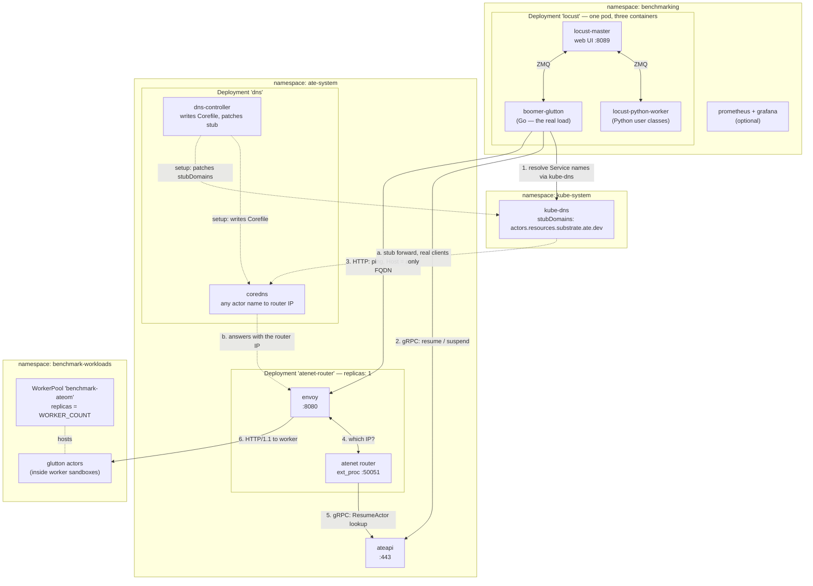
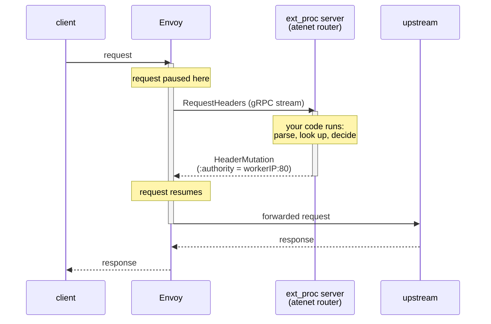
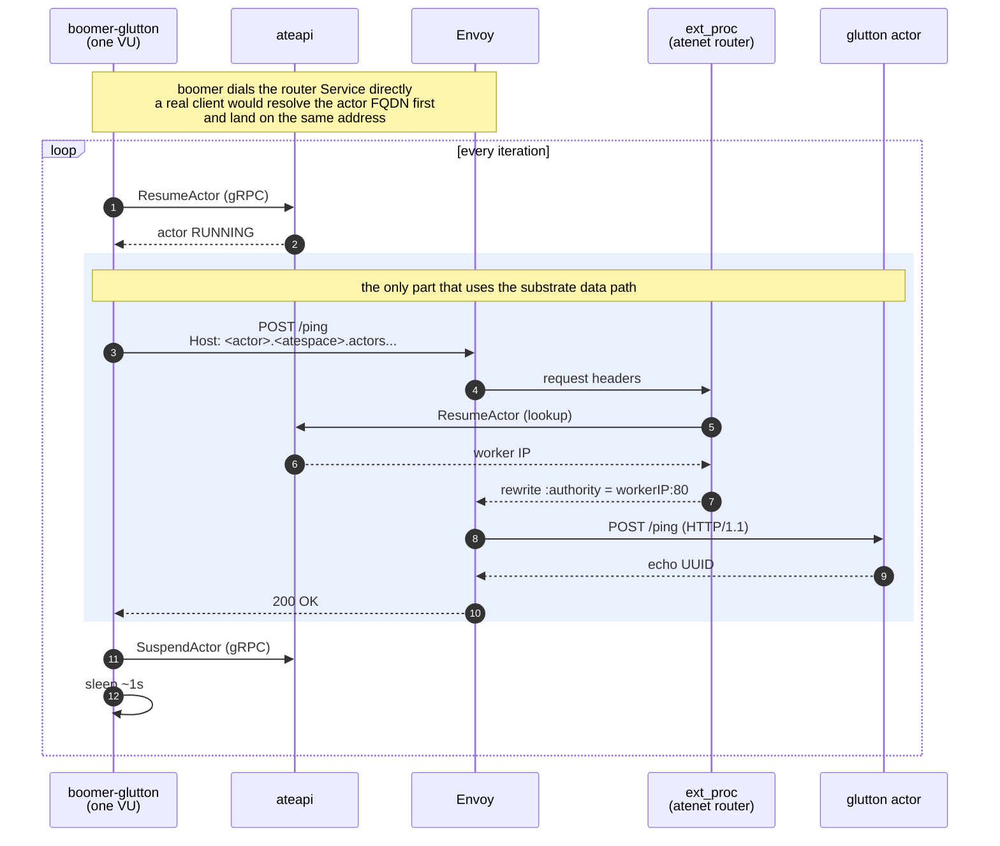
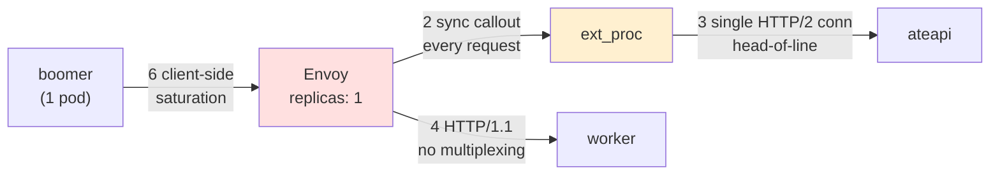

# Benchmark Onboarding

A ground-up introduction to the substrate scale test, for someone who has read
[docs/architecture.md](../docs/architecture.md) and nothing else.

If you want the operational reference (deploy flags, teardown, automation
CronJob), read [README.md](README.md) instead. This document explains *why the
harness looks the way it does* and *where the network can stop it from scaling*.

---

## 1. What is this test trying to prove?

The substrate keeps a small pool of warm worker pods and multiplexes a large
number of actors onto them, waking an actor in ~100ms.

The scale test asks the follow-up question: **does that still hold when lots of
things happen at once?** One actor waking in 100ms is easy. A thousand per
second is the actual product claim.

So we need something that pretends to be a thousand impatient users. That's all
a load test is.

---

## 2. Locust — the load-testing tool

[Locust](https://locust.io) is an off-the-shelf open-source load testing tool.
Nothing substrate-specific. Its model:

- You write a class describing **one** simulated user — "do this, then this,
  then wait a second, repeat forever."
- Locust runs N copies of that class concurrently. Each copy is a **user** (or
  VU, virtual user).
- A **master** process holds the brain and a web UI on port 8089, where you type
  "run 50 users for 2 minutes" and watch a live graph. **Worker** processes
  actually send the requests. They talk over a message queue.
- At the end you get requests/sec, median latency, p95, p99, and failure counts.

In this repo the master and the workers all live in a **single pod** with three
containers, in namespace `benchmarking`. That's for convenience — they share a
network namespace, so they reach each other over `localhost`.

---

## 3. Boomer — why there's a Go program in the middle

Python is slow, and Locust's concurrency model (gevent) struggles once you want
real load. If your load generator is the slowest thing in the system, you are
measuring the load generator, not the substrate.

[Boomer](https://github.com/myzhan/boomer) is an open-source Go library that
speaks Locust's worker protocol. So we get both halves: the load is generated by
fast Go code, but it still appears in the Locust web UI and stats table as a
normal worker.

That's the third container in the pod: `boomer-glutton`.

> **Gotcha you will hit.** [locust/tests/glutton.py](locust/tests/glutton.py)
> *looks* like it defines the test, but its task body is empty. It is a
> **placeholder** so that `GluttonUser` appears in the web UI's class picker. The
> real logic lives in Go at
> [internal/benchmarking/boomer/glutton/lifecycle.go](../internal/benchmarking/boomer/glutton/lifecycle.go).
> Editing the Python file will not change behavior.

---

## 4. Glutton — the thing being called

An actor has to *run something*. **Glutton**
([cmd/benchmarking/glutton](../cmd/benchmarking/glutton/main.go)) is a
deliberately boring little server written for this repo and deployed as an
actor. You send it `/ping` with a UUID; it sends the UUID back.

It is named "glutton" because it can also be told to consume CPU, memory, and
disk on demand — but the scale test only uses `/ping`.

The point is that it does *almost nothing*, so any latency you measure is
substrate overhead, not application work.

---

## 5. How the pieces fit together

Three namespaces, each with one job.

**`benchmarking` — where the load comes from.** A single pod holds all three
load-generation containers. `locust-master` owns the web UI and the run
lifecycle: it decides how many users exist, tells the workers to spawn them, and
aggregates every result into the stats table you watch. It never sends a request
itself. `locust-python-worker` runs the Python user classes (`AteAPIUser`,
`SleepUser`, `CounterUser`), none of which matter for the scale test.
`boomer-glutton` is the Go worker that generates the actual load. All three
share a network namespace, so the workers reach the master at `localhost:5557`
over ZMQ rather than through a Service.

**`ate-system` — the substrate itself.** `atenet-router` is one pod with two
containers that are useless apart: `envoy` is the proxy that terminates client
connections and forwards to actors, and `atenet router` is the Go process that
tells Envoy *where to forward*. They talk over `localhost` on two channels —
xDS on :18000 (Envoy asking "what's my configuration?") and ext_proc on :50051
(Envoy asking, per request, "where does this actor live?"). `ateapi` is the
control plane that owns actor state in Redis; both the load generator and the
router query it.

**`benchmark-workloads` — what gets called.** The `WorkerPool` provides the warm
pods, sized by `--worker-count` at deploy time. The glutton actors run inside
sandboxes on those pods. This is the knob you turn to change how much capacity
the test has to work with.

### Why boomer uses two different paths

Notice that `boomer-glutton` has two arrows leaving it, and they go to different
places. This trips up everyone at first, so it's worth being explicit.

**The difference is what you are addressing, not what you are doing.**

| | Lifecycle path | Data path |
|---|---|---|
| Example call | `ResumeActor`, `SuspendActor` | `POST /ping` |
| Protocol | gRPC | HTTP |
| Addressed to | `api.ate-system.svc:443` | `atenet-router.ate-system.svc:80` |
| You are talking to | **the substrate** | **an actor** |
| Meaning | "wake up actor X for me" | "actor X, here is some work" |

The lifecycle calls are **management** operations. They are addressed *to
ateapi* — a normal, always-running Kubernetes Deployment with a stable Service
name and a stable IP. You dial it the way you'd dial any gRPC service. Nothing
needs to be discovered.

The ping is a **workload** request. It is addressed *to an actor*, and actors
are nothing like ateapi:

- an actor has **no Service and no DNS record of its own** — its name does
  resolve, but only to the router, never to the actor (see below);
- it might not be **running** right now;
- when it is running, it lives at whatever worker pod the scheduler picked, so
  its IP **changes** every time it's rescheduled.

**You cannot open a socket to something with no address. So the substrate puts a
proxy in front**: you send the request to the *router's* stable address and put
the actor's name in the `Host` header, and the router figures out the rest. That
indirection is the entire reason `atenet-router` exists.

> **The part that actually confuses people:** *both* paths end up calling
> `ResumeActor` on ateapi. The first line of the test loop calls it directly over
> gRPC; ext_proc then calls it again internally while handling the ping. Same
> logical operation, two different callers. It is not a duplicate bug — the
> router has to resolve the actor whether or not the client happened to resume it
> first. (It does mean the router's lookup is a *warm* one in this test. More on
> that at the end of §7.)

This split is not a benchmark quirk — it mirrors how a real client uses the
substrate. ***You manage actors through the control API, and you send them real
traffic through the router.*** The benchmark talks to both because a real workload
would.



Reading the labels:

- **1–6** are one benchmark iteration, in order. Steps 4 and 5 happen inline,
  inside step 3 — Envoy pauses the ping while ext_proc resolves the actor.
- **a–b** are the DNS hops a *real* client makes instead of step 1: it resolves
  the actor FQDN, kube-dns forwards to the substrate's CoreDNS, and the answer is
  the router's IP. boomer skips both.
- **setup** edges run once at install time, not per request.
- Unlabelled edges are neither: ZMQ is locust's internal control channel, and
  `hosts` is a containment relationship rather than traffic.

### Where DNS fits — and why the benchmark skips it

An actor has no DNS record of its own, but its *name* is still a resolvable
hostname. That is what the `dns` Deployment in `ate-system` is for.

It runs a CoreDNS instance with a single template rule: any A query matching
`<actor>.<atespace>.actors.resources.substrate.ate.dev` is answered with the
**router's** ClusterIP, TTL 60. Alongside it, `dns-controller` patches the
cluster's `kube-dns` ConfigMap to add a stub domain, so queries for that suffix
get forwarded to the `ate-system:dns` Service rather than resolved normally. See
[cmd/atenet/internal/dns/README.md](../cmd/atenet/internal/dns/README.md).

Both halves are visible on a running cluster:

```bash
kubectl get svc -n ate-system dns -o jsonpath='{.spec.clusterIP}'
# 34.118.238.168

kubectl get cm -n kube-system kube-dns -o jsonpath='{.data.stubDomains}'
# {"actors.resources.substrate.ate.dev":["34.118.238.168"]}
```

So a real client's full path is: resolve the actor FQDN, kube-dns forwards to the
substrate's CoreDNS, that returns the router's IP, connect there with the actor
name in the `Host` header, and ext_proc resolves the rest. Every actor name
resolves to the same address. **DNS gets you to the proxy; the `Host` header gets
you to the actor.**

**boomer skips the first two hops.** `--router-url` defaults to
`http://atenet-router.ate-system.svc.cluster.local`
([main.go:40](../cmd/benchmarking/boomer-glutton/main.go#L40)), so it dials the
router's Service directly and merely sets `Host` to the actor FQDN
([lifecycle.go:299](../internal/benchmarking/boomer/glutton/lifecycle.go#L299)).
The stub domain is never queried.

Same destination by a shorter route, and it is deliberate — one less moving part
in the measurement. But it does mean **the scale test does not exercise actor DNS
at all.** If resolution ever turns out to be a bottleneck for real clients, this
benchmark will not show it.

### Golden actors — and why they cost you a worker

Nothing above explains where an actor *comes from*, and the answer has a direct
effect on how much capacity your test needs.

Cold-booting an actor is slow: pull the image, unpack an OCI bundle, start a
gVisor sandbox, wait for the process to initialize. Doing that per actor would
defeat the entire premise of the substrate. So it is done **once per
`ActorTemplate`**, and every actor afterwards is restored from the result.

The thing that does the booting is the **golden actor**. You never create it.
When you apply an `ActorTemplate`, `atecontroller` runs a four-phase state
machine ([actortemplate_controller.go](../cmd/atecontroller/internal/controllers/actortemplate_controller.go)):

| Phase | What happens |
|---|---|
| `Initial` | Creates one actor from the template in the reserved `ate-golden` atespace. Its ID is recorded in `status.goldenActorID`. |
| `ResumeGoldenActor` | Resumes it. No snapshot exists yet, so this is a genuine cold boot. |
| `WaitGoldenActor` | Waits for warmup, then **suspends** it — which writes a checkpoint to snapshot storage. |
| `Ready` | Records the snapshot URI in `status.goldenSnapshot`. |

From then on, `ResumeActor` for any actor of that template restores from that
shared snapshot instead of booting
([workflow_resume.go](../cmd/ateapi/internal/controlapi/workflow_resume.go)).
That restore is the ~100ms wake-up the product claim is about.

The warmup is 20s by default, or **zero** if every container in the template
declares a `readyz` probe — with a probe, `ResumeActor` already blocked until the
workload returned 200, so there is nothing left to wait for. Neither `sleep` nor
`glutton` declares one, so both take the 20s path.

Three consequences that matter when you are running benchmarks:

1. **A golden actor occupies a real worker while it is being built.** It is an
   ordinary actor as far as the scheduler is concerned. Two templates plus
   `--worker-count 1` means they are built one after another, and until both are
   `Ready` your own actors are competing for the same single slot.
2. **A template stuck below `Ready` blocks every actor of that template**, and
   the error surfaces at the *caller* as `FailedPrecondition: no free workers
   available` — which reads like a capacity problem and isn't.
3. **Golden actors are invisible to a single-atespace listing.** They live in
   `ate-golden`, not in your atespace, so `kubectl ate get actors -a benchmark`
   will not show them. Use `-A`.

Check both when something is wedged:

```bash
kubectl get actortemplate -n benchmark-workloads \
  -o custom-columns='NAME:.metadata.name,PHASE:.status.phase'
kubectl ate get actors -A     # -A matters: goldens live in ate-golden
kubectl ate get workers       # STATUS FREE vs ASSIGNED, and to whom
```

A golden actor stuck in `STATUS_RESUMING` holds its worker indefinitely — the
controller has [a known TODO](../cmd/atecontroller/internal/controllers/actortemplate_controller.go)
about exactly this leak. The usual cause is that atelet cannot pull the image;
`kubectl logs -n ate-system -l app=atelet` will say so plainly. You cannot
suspend or delete an actor mid-workflow (`Aborted: another operation is in
progress`), so fix the underlying cause and let the retry finish.

---

## 6. ext_proc — how Envoy finds an actor

The previous section said the router "figures out the rest." This is how.

**ext_proc (External Processing) is a stock Envoy feature**, not something this
project invented. It lets you outsource request handling to an external gRPC
service. Envoy opens a bidirectional gRPC stream to that service and, at chosen
points in a request's life, sends it a message and waits. The service replies
with **mutations** — change these headers, redirect this request, return this
canned response — and Envoy applies them and carries on.

The reason it exists: extending Envoy normally means writing a C++ filter, or
WASM, or Lua. ext_proc lets you write an ordinary gRPC server in any language and
plug it into the request path. Here that server is the `atenet router`
container, written in Go, listening on `:50051`.



### How substrate configures it

From [xds.go](../cmd/atenet/internal/router/xds.go) — four settings do all the
work, and each one has a consequence worth knowing:

| Setting | Value | What it means for you |
|---|---|---|
| `ProcessingMode` | `RequestHeaderMode: SEND`, everything else `SKIP`/`NONE` | Envoy calls out **once per request**, with headers only. It never ships request bodies, response headers, or trailers to the router. This is the cheapest possible ext_proc config — the router never sees your payload. |
| `MutationRules.AllowAllRouting` | `true` | By default ext_proc is **forbidden** from touching routing headers like `:authority`. Substrate's whole mechanism is rewriting `:authority`, so this must be on. |
| `MessageTimeout` | `5s` | How long Envoy waits for the router to answer before giving up on the request. |
| *(no* `failure_mode_allow`*)* | — | Omitted, so it defaults to **fail closed**. If the router is slow or down, the request **fails** rather than being forwarded unmodified. Sensible — an unmodified request has nowhere to go — but it means the router is a hard dependency of every request. |

### Filter chain order matters

Envoy runs HTTP filters in the order they're listed
([xds.go](../cmd/atenet/internal/router/xds.go)):

```
ext_proc  →  dynamic_forward_proxy  →  router
```

- **`ext_proc`** decides the destination and writes it into `:authority`.
- **`dynamic_forward_proxy`** reads `:authority` and dials it. It's what lets
  Envoy connect to an address that wasn't in its configuration — which is
  essential, because worker IPs are not known ahead of time.
- **`router`** performs the actual forwarding.

The order is not arbitrary: `ext_proc` must run *before* `dynamic_forward_proxy`,
or DFP would dial the original hostname instead of the resolved worker IP.

### Why this matters for scale

Two properties of this design shape everything in §8:

1. **The callout is synchronous and per-request.** There is no cache. Every
   single request pauses while the router does a lookup. Data-plane throughput
   is therefore bounded by control-plane throughput.
2. **The 5s timeout is a ceiling on how long a lookup may take.** If resolving
   an actor takes longer than 5s, the client gets an error — even if the
   resolution eventually succeeds.

---

## 7. What one simulated user actually does

The whole test is four lines
([lifecycle.go](../internal/benchmarking/boomer/glutton/lifecycle.go)):

```go
user.resume(ctx)      // "wake my actor up"     — gRPC to ateapi
user.ping(ctx)        // "actor, say hello"     — HTTP through the router  ← the network part
user.suspend(ctx)     // "put it back to sleep" — gRPC to ateapi
time.Sleep(...)       // wait ~1s, then loop
```

Wake, poke, sleep, repeat. Run ten of those concurrently and you have the
10-user scale test.

Each VU owns exactly one actor for the lifetime of the run — it creates the
actor on its first iteration and reuses it thereafter. So "10 users" also means
"10 distinct actors", and the wake/sleep cycle is what keeps those actors moving
between suspended and running rather than just sitting hot.



Walking the highlighted block, which is the part you care about:

1. **The client addresses the actor by name, not by IP.** boomer sends the
   request to the router's Service address, but sets the HTTP `Host` header to
   `<actor-id>.<atespace>.actors.resources.substrate.ate.dev`. The actor's
   identity travels in a header; the connection itself just goes to the proxy.
2. **Envoy has no route for that name.** Its configuration contains a single
   catch-all route. It cannot resolve the actor on its own, so before doing
   anything else it hands the request headers to ext_proc and waits.
3. **ext_proc resolves the actor.** The `atenet router` process parses the actor
   ID out of the `Host` header and calls `ResumeActor` on ateapi, which looks up
   (and if necessary wakes) the actor and returns the IP of the worker hosting
   it.
4. **ext_proc rewrites the destination.** It overwrites the `:authority` header
   with `workerIP:80` and returns control to Envoy. Envoy's dynamic forward
   proxy then dials whatever address it was just handed.
5. **The request finally reaches the actor**, over HTTP/1.1, and the response
   travels straight back — the response path does not go through ext_proc.

The thing to take away: **Envoy does not know where actors live.** For **every
single request**, it stops and asks the substrate's own control plane before it
can forward a single byte. Steps 2–4 happen inline, in the request path, on every
call. That pause is the heart of any bottleneck investigation — it is the reason
data-plane throughput is coupled to control-plane throughput, and it is where
several of the candidates in the next section live.

One consequence worth internalizing early: by the time step 2 runs, the VU has
already called `ResumeActor` itself over gRPC in the first line of the loop. The
actor is therefore already running, and the lookup in step 3 is a **warm** one.
The stock test measures steady-state forwarding, not cold-start through the
proxy.

---

## 8. Where the network can stop this from scaling

Candidates, roughly in the order they are likely to bite. These are hypotheses
to test, not confirmed findings.



| # | Bottleneck | Why it limits scale |
|---|---|---|
| 1 | **Exactly one router pod.** [atenet-router.yaml](../manifests/ate-install/atenet-router.yaml) sets `replicas: 1`. | Every request from every actor in the cluster funnels through one Envoy process. This is a design limit, not a tuning knob. Most likely hard ceiling. |
| 2 | **Every request costs a synchronous control-plane round trip.** ext_proc is not a cache — Envoy blocks on gRPC to ateapi (which hits Redis) before forwarding. | Max data-plane throughput can never exceed control-plane lookups/sec, no matter how fast Envoy is. |
| 3 | **Router → ateapi is one gRPC connection.** gRPC multiplexes over a single HTTP/2 connection. | Under concurrency you get head-of-line blocking: one slow lookup delays everything queued behind it. |
| 4 | **Envoy → worker is HTTP/1.1.** No multiplexing. | Each concurrent request needs its own TCP connection. Pool exhaustion shows up as queueing that looks like latency. |
| 5 | **A 5s timeout that fires too early.** Envoy gives ext_proc 5s; the resume logic behind it has a 15s budget. | A wake-up slower than 5s returns 500 to the client *even though the actor woke fine*. Creates a wall of errors at exactly 5s that looks like network failure but is a misconfigured timeout. |
| 6 | **Your own load generator.** One pod generates all the load. | Before blaming the substrate, confirm the client is not the saturated thing. |

---

## 9. The web UI — the six classes and every knob

The master runs with `--class-picker`
([locust.yaml](locust/manifests/locust.yaml)), so the start form lists every
`User` subclass found under `/app/tests`. There are six, and the important
distinction between them is **data plane vs. control plane**.

| Class | Actor template | One iteration |
|---|---|---|
| **`GluttonUser`** | `benchmark-workloads/glutton` | Resume → **`POST /ping` through atenet-router** → Suspend |
| `CounterUser` | `ate-demo-counter/counter` | Resume → **`POST /` through atenet-router** → Suspend |
| `AteAPIUser` | `ate-demo-counter/counter` | GetActor → Resume → Suspend (gRPC only) |
| `SleepUser` | `benchmark-workloads/sleep` | sleep 0.5s → Suspend → sleep 0.5s → Resume |
| `UserMemUser` | `benchmark-workloads/usermem` | identical to `SleepUser` |
| `KernelMemUser` | `benchmark-workloads/kernelmem` | identical to `SleepUser` |

Only the first two send traffic *through* the router into an actor sandbox.
The other four never leave the control plane — they measure how fast the
substrate can suspend and resume, not how fast packets move. **For a bottleneck
hunt, `GluttonUser` is the only one that matters**; it is also the only class
backed by Go rather than gevent (§3).

The last three are the same file three times
([sleep.py](locust/tests/sleep.py), [usermem.py](locust/tests/usermem.py),
[kernelmem.py](locust/tests/kernelmem.py)), differing only in `template_name`.
The intent is to vary what the *actor* does — idle vs. dirtying user memory vs.
dirtying page cache — which changes snapshot and restore cost.

### What to deploy for each class

A class only works if its `ActorTemplate` exists in the cluster. Pick one whose
template is absent and every user fails `CreateActor` with `NOT_FOUND`. The six
classes are covered by three different deploys, and the default gets you two of
them.

**`GluttonUser` and `SleepUser`** — the default:

```bash
./benchmarking/workloads/deploy.sh --deploy --worker-count 10
```

This applies [workloads.yaml.tmpl](workloads/manifests/workloads.yaml.tmpl),
which defines the `benchmark-workloads` namespace, a `WorkerPool`, and exactly
those two templates. `deploy_locust.sh --deploy` calls it for you, so if you
followed §10 you already have them.

**`UserMemUser` and `KernelMemUser`** — these templates exist only in
[full_workloads.yaml.tmpl](workloads/manifests/full_workloads.yaml.tmpl), which
no script applies. `deploy.sh` hardcodes the other template path, so apply it
yourself:

```bash
source .ate-dev-env.sh
sed "s|\${BUCKET_NAME}|${BUCKET_NAME}|g" \
  benchmarking/workloads/manifests/full_workloads.yaml.tmpl \
  | hack/run-tool.sh ko apply -f -
```

It is a superset — all four benchmark templates — so it replaces the default
deploy rather than supplementing it. Two differences to know: its `WorkerPool`
is pinned at `replicas: 5` with no `${WORKER_COUNT}` substitution, so edit the
file if you need more; and going from two templates to four means two more
golden actors to build, each of which takes a worker for ~20s (§5).

**`CounterUser` and `AteAPIUser`** — a separate demo, in its own
`ate-demo-counter` namespace with its own `WorkerPool`:

```bash
./hack/install-ate.sh --deploy-demo-counter
```

The script blocks until the template is `Ready`, so when it returns you can
start a run immediately.

Whatever you deployed, confirm before you start:

```bash
kubectl get actortemplate -A \
  -o custom-columns='NS:.metadata.namespace,NAME:.metadata.name,PHASE:.status.phase'
```

Every template you plan to use must read `Ready`. Anything else means its golden
actor has not finished, and your run will fail with `no free workers available`
rather than anything that points at the real cause (§5).

### The start form

| Field | Meaning |
|---|---|
| **Number of users (peak concurrency)** | Total VUs, split across the selected classes by weight. Every class here uses the default weight of 1, so the split is even. |
| **Ramp up (users started/second)** | This **is** spawn rate — locust 2.x renamed the label; it still maps to `--spawn-rate`. Nothing is missing from the form. |
| **Host** | Prefilled from the class's `host` attribute. **Leave it alone.** For the Python classes `host` doubles as the ateapi gRPC target, so overwriting it breaks them. boomer ignores it entirely and uses its own `--api-endpoint` / `--router-url` flags. |
| **Advanced options → Run time** | `20`, `20s`, `3m`, `1h20m`. Blank means run until you press Stop. |

Both count fields are disabled if a `LoadTestShape` class is loaded, which is
why [shapes/burst_shape.py](locust/shapes/burst_shape.py) is **not** under
`/app/tests` — loading it would take the manual controls away.

### Custom parameters

Three, registered with `include_in_web_ui=True` and therefore rendered as form
fields:

| Parameter | Default | Meaning |
|---|---|---|
| `trace-probability` | `0.0` | Fraction of iterations recorded as a distributed trace. See below. |
| `min-wait-time` | `0.0` | Lower bound of the per-iteration sleep. |
| `max-wait-time` | `0.5` | Upper bound. Each iteration sleeps `uniform(min, max)` ([wait_time.py](locust/common/wait_time.py)); setting both to the same value gives a fixed cadence, which is what [automation/tests.yaml](automation/tests.yaml) does. |

For the Sleep/UserMem/KernelMem classes the wait bounds stack on top of two
hardcoded `time.sleep(0.5)` calls inside the task body, so the floor is 1s per
iteration regardless of what you type.

#### `trace-probability` in detail

Locust's own stats tell you *that* an iteration took 900ms — one number per
request, with no way to see inside it. A trace is the breakdown. For one sampled
`GluttonUser` iteration you get a span tree: `GluttonResume` (the gRPC call to
ateapi, with ateapi's own spans nested under it), then `GluttonPing` covering
the HTTP call, with atenet-router's ext_proc callout and the actor's handling
nested under *that*, then `GluttonSuspend`. When p99 is bad, this is what tells
you whether the cost is in the resume, the ext_proc lookup, or the actor.

It is a probability rather than a checkbox because sampling is decided **once**,
at the root span, by hashing the trace ID
([trace.py](locust/common/trace.py)). If the answer is yes, the trace ID and the
decision travel downstream — as a W3C `traceparent` header on the HTTP request
([lifecycle.go](../internal/benchmarking/boomer/glutton/lifecycle.go)) and via
an otelgrpc handler on the gRPC calls
([grpcclient.go](../internal/benchmarking/boomer/glutton/grpcclient.go)). Every
substrate component that receives it joins the *same* trace instead of deciding
for itself, which is what makes the tree whole. A sampled iteration shows the
entire path end to end; an unsampled one shows nothing. There are no partial
traces.

The default is `0.0` because each sampled iteration exports a dozen-plus spans
over OTLP to `opentelemetry-collector.gke-managed-otel.svc.cluster.local:4317`,
and that work happens inside the same pod generating your load. At high user
counts `1.0` means you are measuring the tracing as much as the substrate.

So: **`1.0` at 1–5 users** when you are diagnosing where latency comes from,
**`0.01`** during a real ramp to catch a sample of slow requests without
perturbing the number you are measuring, and **`0.0`** for a clean throughput
figure.

The sampler is refreshed on test start, so changing the field between runs
works — but changing it mid-run does nothing until the next one.

`GluttonUser` needs extra plumbing here, because boomer is a Go process that
cannot read a Flask form. The master exposes the three values at
`/boomer-config` ([boomer_config.py](locust/common/boomer_config.py)) and boomer
re-fetches them on every spawn message
([locust.yaml](locust/manifests/locust.yaml)). It works, but it means a
mid-run change only takes effect when the user count changes. In headless runs
there is no web UI, so [runner.py](locust/runner.py) forwards the same flags to
boomer via `--config-json` instead.

---

## 10. Running it

```bash
source .ate-dev-env.sh                                     # cluster + project config
./benchmarking/deploy_locust.sh --deploy --worker-count 10  # actors + load pod
kubectl port-forward svc/locust -n benchmarking 8089:8089   # open localhost:8089
```

In the web UI, pick `GluttonUser` from the class list, enter a user count, and
start.

`--worker-count` must be **at least** your peak user count: each running actor
holds one worker exclusively, and the golden actors need a free slot at deploy
time too (§5). The flag defaults to 1, which is enough for exactly one user and
nothing else.

### Undersized runs fail in a misleading way

This is the single easiest way to waste an afternoon, so it is worth knowing the
shape of it. Run 100 users against 3 workers and you get something like:

| Operation | Requests | Failures |
|---|---|---|
| ResumeActor | 86,297 | 86,204 |
| ResumeActorColdStart | 35,502 | 35,465 |
| GluttonPing | 130 | 66 |

Three things are going on.

**The resume failures are the whole story.** Every one is
`FailedPrecondition: no free workers available`. Three workers means three
actors resumed at any instant; the other 97 users have nowhere to go.
`ResumeActor` and `ResumeActorColdStart` are the same call — only `Boot` differs
([lifecycle.go](../internal/benchmarking/boomer/glutton/lifecycle.go)) — and a
user that never once gets a worker keeps `firstResume` true, so it retries the
cold path forever.

**Do not read those request counts as throughput.** They are retries. A starved
VU is paced by the wait-time knobs (§9) and nothing else, so at the default
`uniform(0, 0.5)` each one re-attempts a couple of times a second and 50 VUs
produce thousands of "requests" that never did any work. Set both wait bounds to
`0` and you remove even that pacing — the VUs then retry as fast as a gRPC round
trip allows, which is how the numbers above reached 120k in two minutes.

**Ignore the `GluttonPing` percentage.** Ping only runs after a successful
resume, so a starved run produces a tiny sample — 130 here. A 51% failure rate
on 130 requests, taken while three workers thrash among fifty actors, tells you
nothing you can act on. Fix the worker count first; if the 503s survive at
adequate capacity, *then* you have a routing finding worth chasing.

The tell is the ratio: resume failures in the tens of thousands with pings in
the low hundreds means you are measuring a capacity shortfall, not the network.

The existing suite in [automation/tests.yaml](automation/tests.yaml) has four
scale points:

| Name | Users | Workers | Duration |
|---|---|---|---|
| `glutton_baseline_1_user` | 1 | 1 | 1m |
| `glutton_baseline_5_users` | 5 | 5 | 1m |
| `glutton_baseline_10_users` | 10 | 10 | 1m |
| `glutton_oversubscribe_15_users` | 15 | 10 | 2m |

At roughly 1 request/sec per user, peak load is about **15 requests/sec**. That
is tiny — this suite is a regression tripwire, not a bottleneck hunt. Finding a
ceiling means going well past it.

> **Build tooling note.** Substrate images are built with `ko`, which produces
> OCI images directly and needs **no container runtime**. The locust image is the
> one exception: [locust/build_and_push.sh](locust/build_and_push.sh) shells out
> to `docker build`, so that single step needs Docker (or a Cloud Build
> substitute). See [GKE_SETUP.md](GKE_SETUP.md) for the full prerequisite list.

---

## 11. Cleaning up between runs

**Pressing Stop does not clean up actors.** boomer suspends and deletes the
actors it created only after `boomer.Run` returns, which requires SIGTERM or a
master *quit* — a stop message is neither
([main.go](../cmd/benchmarking/boomer-glutton/main.go)). Every actor from the run
is left behind, and boomer's in-memory `goroutineID → actor` map survives into
the next run, so leftovers accumulate across runs.

The reliable reset is a rollout restart, which SIGTERMs boomer and runs its real
cleanup path:

```bash
kubectl rollout restart deploy/locust -n benchmarking
kubectl rollout status  deploy/locust -n benchmarking
```

Then verify. You should see only the `ate-golden` actors, and every worker
`FREE`:

```bash
kubectl ate get actors -A     # -A matters: goldens live in ate-golden
kubectl ate get workers
```

If actors survive that — boomer crashed, or they predate the current pod —
delete them by hand. They must be suspended first; an actor mid-workflow holds a
lock and will refuse with `Aborted: another operation is in progress`:

```bash
for id in $(kubectl ate get actors -a benchmark -o json | jq -r '.[].id'); do
  kubectl ate suspend actor "$id" -a benchmark 2>/dev/null
  kubectl ate delete  actor "$id" -a benchmark
done
```

Leave the `ate-golden` actors alone. Deleting one forces its template to rebuild
the golden snapshot, which costs a worker and ~20s per template (§5).

---

## 12. Where to go next

- **Run it once end to end** at 1 user and read the output, before scaling
  anything.
- **Trace one `/ping` through the code**, file by file, from boomer to the actor.
- **Ramp until it breaks** and work out which of the six candidates above gave
  way.

The first is the best starting point. A clean baseline run makes everything
after it easier to interpret.
