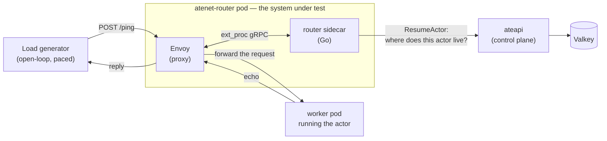

# Envoy capacity measurement

A push-button benchmark that answers one question about the substrate entry
path: **at what offered request rate does p95 latency through one
`atenet-router` cross 500 ms?**

```bash
benchmarking/envoycap/provision.sh   # once: builds a dedicated cluster (~25 min)
benchmarking/envoycap/run.sh         # the measurement (~10 min)
```

Latest results: [results/RESULTS.md](results/RESULTS.md).

---

## Why this exists

For capacity planning. If one router sustains *N* QPS inside a latency budget,
then `replicas = desired_QPS / N`.

It has to be a **curve, not a number**. Latency vs throughput is asymptotic, so
"max throughput" is undefined until you fix a latency budget and read the rate
off the crossing point. 500 ms is the budget we picked; the harness reports the
whole curve, so a different budget can be read off the same run.

---

## What's being measured

`atenet-router` is the entry point to substrate — one pod running **two**
containers, an Envoy proxy and a Go sidecar. Every request through it does two
things: a control-plane lookup to find out where the target actor lives, then a
proxy hop to the pod running it.



The lookup happens through **ext_proc**, an Envoy filter that pauses a request
mid-flight and asks an external gRPC service what to do with it. Here that
service is the router sidecar, which calls `ateapi`. There is no resume cache,
so *every* request pays that round trip.

**The workload is trivial on purpose.** Each actor runs
[`glutton`](../../cmd/benchmarking/glutton) — the echo workload this repo
already ships for benchmarking, reused as-is via its existing `ActorTemplate`.
It just returns the protobuf you POST to it. What's measured is the entry path,
not anyone's application code.

**Envoy is not necessarily the bottleneck.** The run records enough per-layer
detail to say which component actually ran out — see
[Layer attribution](#layer-attribution).

---

## Method

### Open-loop generation

**Arrival rate is the input; latency is the output.** This is the central design
constraint.

The alternative — a closed loop, where threads wait for a reply before sending
again — stops offering load exactly when the server slows down. A struggling
server then looks healthy, because the generator quietly backed off.

Four properties follow from that:

- **Even pacing.** Send times are fixed in advance from the start of each rung,
  so arrivals are evenly spaced. No token bucket, no bursts.
- **No coordinated omission.** Latency is measured from a request's *scheduled*
  send time, not from when it actually went out. A request delayed by a busy
  client still reports the full delay.
- **Failures count.** Timeouts and HTTP errors contribute their latency to the
  percentiles. Dropping them would flatter the numbers exactly when the system
  is in trouble.
- **The client never becomes the limit.** The connection pool and in-flight
  capacity are sized from the request timeout, so the loop stays open even if
  latency climbs into seconds. If the generator ever does fall behind, it blocks
  rather than skipping, and the shortfall is recorded as **dispatch lag**.

### Cluster layout: three pools, one node each

Everything is isolated onto its own node, so no result can be blamed on two
things sharing a CPU:

| Node pool | Nodes | Runs |
|---|---|---|
| `substrate-node-pool` | 1 × `c3-standard-88` | the system under test — `atenet-router`, plus `ateapi`, `dns`, `valkey` |
| `workers` | 1 × `c3-standard-88` | the 40 worker pods hosting the actors |
| `loadgen` | 1 × `c3-standard-88` | the load generator, alone (node is tainted) |

**Same machine type everywhere, deliberately.** An earlier version of this
benchmark ran on shared 8-vCPU nodes and produced a latency curve that was not a
function of offered rate; contention was the leading suspect and the data could
not rule it out. Identical, oversized nodes mean no finding can be explained
away as one role having landed on a smaller box.

**Note that a bigger node changes Envoy's behaviour**, without anything being
configured. Envoy sizes its worker threads from the CPU count it sees, and
substrate never sets `--concurrency`, so on these nodes the proxy under test
runs **88 event loops** instead of 8. Envoy reports that number itself; the run
scrapes it and records it as `envoy_concurrency`. It is a consequence of the
machine type, not a change to the deployment.

### The actor pool

One actor occupies exactly one worker pod, so 40 actors means a `WorkerPool` of
40 replicas. Requests are spread evenly across the pool, round-robin.

All 40 are resumed once during setup and **left running for the whole run**, so
every measured request hits the warm path — a cold resume costs ~3.8 s and would
swamp everything else.

### The ladder

- Linear: `--start-qps` → `--max-qps` in `--steps` rungs.
- Each rung is held for `--step-duration`; the first 8 s is discarded as warmup.
- Percentiles are exact — computed from the raw samples, not estimated.
- **The whole ladder always runs.** No early stop, no bisection. The shape above
  the budget is the interesting part.
- `--repeat N` runs the ladder N times and plots each pass separately.
  Agreement between passes is what makes a number trustworthy; disagreement is
  itself a finding.

### Ruling out the rig

"The rig ran out" and "the system ran out" are different answers. The run
**aborts loudly** rather than report a number when it was the rig:

| Guard | Threshold | Why |
|---|---|---|
| Requests/s per worker pod IP | 400/s | `max_requests_per_connection: 1` means a fresh TCP connection per request, and ports are only recycled every 60 s. 40 pods ⇒ a **~16,000 QPS rig ceiling**. |
| Load generator CPU | 80% of available | the generator must not be the slow part |
| Envoy `upstream_cx_connect_fail` / `_overflow` / `_connect_timeout` | any non-zero | what port exhaustion looks like from the proxy's side |
| Dispatch lag p99 | 50 ms | beyond this the generator, not the router, is shaping arrivals |

**One exception.** Dispatch lag can be an *effect* rather than a cause: a server
slow enough to tie up the client forces it to block. Aborting there would stop
the ladder at exactly the saturated rungs it exists to measure. So on a step
where the system is demonstrably constrained, lag is recorded and the ladder
runs on ([guards.go](../../internal/benchmarking/envoycap/guards.go)). Every
other guard aborts.

Node CPU is queried from Cloud Monitoring after the run into `nodecpu.json`.

### Layer attribution

Five latencies per rung, so a slow step says *which layer* was slow:

| Measurement | Covers |
|---|---|
| **client** (from scheduled time) | everything, including client-side queueing |
| `envoy_http_downstream_rq_time` | Envoy's own view of the request |
| `atenet.router.route.duration` | the ext_proc handler — the control-plane lookup |
| `envoy_cluster_upstream_rq_time` | the hop out to the worker pod |
| `envoy_cluster_upstream_cx_connect_ms` | just the TCP handshake inside that hop |

Read as: `client − envoy` is client queueing, `route` is the control plane, and
`envoy − route` splits into the worker hop and the TCP connect inside it.

That last split matters because `max_requests_per_connection: 1` makes **every
request pay a fresh handshake**. A slow hop caused by a slow worker and one
caused by a slow connect have different fixes, so they get separate numbers.

Each rung also records peak ext_proc concurrency against Envoy's default
`max_requests: 1024`. The ext_proc stream stays open for the request's entire
lifetime, so that default is a hard cap on concurrent in-flight requests through
the router.

### Measured as shipped

**No Envoy tuning, no logging disabled, no deployment changes.** All of the
following were on for every request, and are carried in each run's JSON:

- `--component-log-level upstream:debug,router:debug,ext_proc:debug`
- `StdoutAccessLog` — one access-log line per request
- OTLP tracing at 100% `RandomSampling`
- `max_requests_per_connection: 1` — a deliberate shipped fix; pooled
  connections to swapped-out worker sandboxes 503'd 42% of pings
- `ate-cluster` on the default `max_requests: 1024`
- no CPU requests on either router container

These are not free. **The numbers are a floor on production capacity, not a
ceiling.**

The one deviation is **scheduling**, applied at provision time by patch and
never by editing `manifests/ate-install/`: the control plane is pinned to
`substrate-node-pool`, and the generator gets a tainted node to itself.
Otherwise the scheduler drifts zero-request BestEffort pods onto the idle
loadgen node, where they compete with the generator. Placement is recorded in
the run JSON.

---

## Running it

### Prerequisites

- `gcloud` authenticated, **including** `gcloud auth application-default login`
  — Cloud Monitoring rejects a plain user token with
  `ACCESS_TOKEN_TYPE_UNSUPPORTED`.
- C3 quota for 3 × `c3-standard-88` = **264 vCPU** in the region. This is above
  the default and generally needs a quota increase.
- `python3` (stdlib only — no pip install).

### 1. Provision, once

```bash
benchmarking/envoycap/provision.sh
```

Idempotent — re-run it to repair a half-provisioned cluster. Builds
`substrate-envoycap` with the three node pools above, installs ate-system, and
waits for all 40 worker pods to be **registered** (not merely running).

It refuses to touch `substrate-bench` or `substrate-poc`, and keeps `KUBECONFIG`
at `~/.kube/substrate-envoycap.config`, so it never moves anyone else's context.

### 2. Smoke test

```bash
benchmarking/envoycap/run.sh --actors 2 --start-qps 10 --max-qps 20 \
  --steps 2 --step-duration 10s --repeat 1
go run ./cmd/kubectl-ate get actors -A   # must show none left
```

### 3. The real run

```bash
benchmarking/envoycap/run.sh
```

The defaults *are* the experiment:

| Flag | Default |
|---|---|
| `--actors N` | 40 |
| `--start-qps N` | 1000 |
| `--max-qps N` | 8000 |
| `--steps N` | 8 |
| `--step-duration D` | 30s |
| `--repeat N` | 2 |

Exit codes: `0` clean, `2` interrupted, `3` rig-limited.

**Ctrl-C is safe.** It deletes the Job with a foreground cascade, which SIGTERMs
the generator, which suspends and deletes every actor on the way out.

### 4. Charts, separately

The chart script takes only a run directory — it never parses logs:

```bash
python3 benchmarking/envoycap/charts.py benchmarking/envoycap/runs/<timestamp>/
```

### 5. Tear down

Three `c3-standard-88` nodes is real money:

```bash
hack/teardown.sh
```

---

## Output

```
runs/<timestamp>/
  job.yaml, job.log, router-node.txt
  summary.json         machine-readable step table  ← the charts read only this
  nodecpu.json         node CPU over the run window
  latency-pass<N>.svg  latency vs offered load, log Y, 500 ms budget line
  throughput.svg       achieved vs offered, with y = x
  report.html          charts + full data table, hover tooltips, self-contained
```

`summary.json` is one record per pass × rung, plus a header naming the cluster,
git SHA, image digest, node placement, actor → pod-IP map, and caveats.

**`report.html` vs [`results/RESULTS.md`](results/RESULTS.md).** `report.html` is
*generated* — charts and the raw table, no interpretation. `RESULTS.md` is
*written* — what the numbers mean, which layer was the constraint, and what to
do about it. They overlap only on the step table.

**Read the two charts together:**

- Latency climbing while achieved throughput still tracks `y = x` → **queueing**.
- Throughput falling off `y = x` → **saturation**.

Different diagnoses, and neither chart shows both.

---

## Reading the output: three traps

**1. `router_sidecar_cpu_cores` is not Envoy's CPU.** It is the **Go sidecar** —
not the `envoy` container beside it in the same pod. Envoy publishes no CPU
counter at all, so its CPU has to come from Cloud Monitoring after the run.

**2. A zero watchdog rules out one thing only.** `envoy_watchdog` counts event
loops that stalled — >200 ms without a tick, or >1 s for a "mega miss." Zero
means no Envoy thread was starved of CPU. It does **not** mean nothing was
queued; the watchdog doesn't fire for work piled up behind a loop that is
ticking along fine.

**3. Envoy's histogram buckets are coarse.** The defaults are 0.5, 1, 5, 10 and
25 ms. Any Envoy-side quantile below ~5 ms is interpolated *inside* the 1–5 ms
bucket, so read it as "between 1 and 5 ms," not to one decimal place.
Client-side percentiles have no such limit — they are exact.

---

## Code map

| Path | What |
|---|---|
| [provision.sh](provision.sh) | builds the cluster |
| [run.sh](run.sh) | preflight, ko build, Job, extract, node CPU, charts |
| [common.sh](common.sh) | cluster identity and the off-limits-cluster guards |
| [charts.py](charts.py) | SVG + HTML from a run directory, stdlib only |
| [manifests/job.yaml.tmpl](manifests/job.yaml.tmpl) | the generator Job |
| [cmd/benchmarking/envoycap](../../cmd/benchmarking/envoycap) | main |
| [internal/benchmarking/envoycap](../../internal/benchmarking/envoycap) | pacer, actors, stats, guards, scrape, report |
