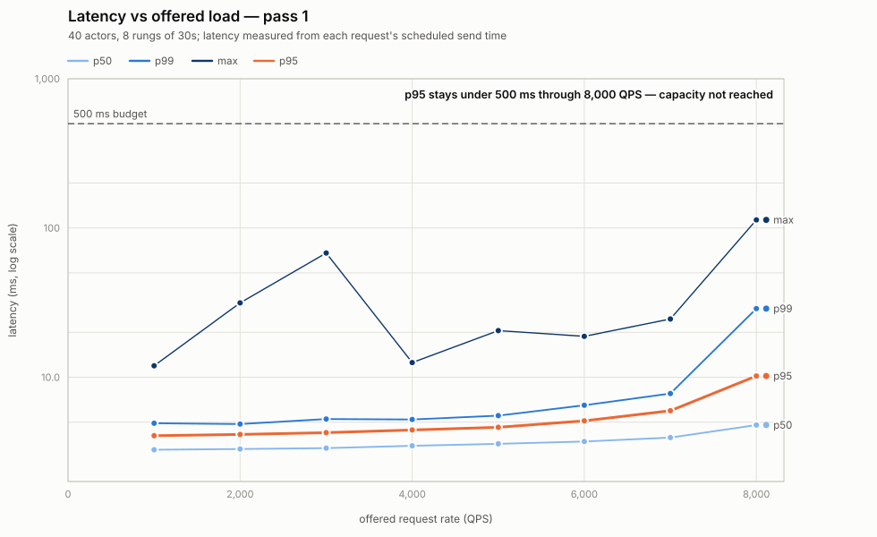
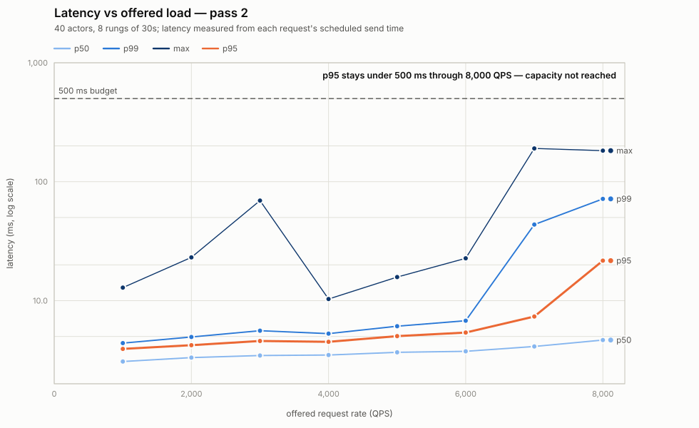
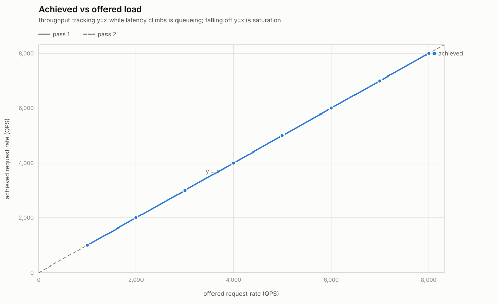

# Envoy capacity: latency vs offered load

**Question.** At what offered request rate does p95 latency through one
`atenet-router` cross 500 ms?

**Answer: not at or below 8,000 QPS.** The ladder ran out before the system
did. The worst p95 anywhere in this run is **21.7 ms at 8,000 QPS** — 23× under
the budget — with zero failed requests in 1,584,000 and achieved throughput on
`y = x` at every rung. So the deliverable is a lower bound, not a crossing:
**one router sustains ≥ 8,000 QPS inside a 500 ms p95 budget.**

**But latency is not what breaks first.** Envoy's `ate-cluster` — the ext_proc
callout to the router sidecar — has no `circuit_breakers` block, so it runs the
default `max_requests: 1024`. Peak concurrent callouts reached 280 of 1024 at
8,000 QPS here, and in [the earlier run on this same
cluster](2026-07-31-c3-88-run1/) reached **946 of 1024 at the same rate,
overflowed 155 times, and returned 109 HTTP 500s while p95 was still only 191
ms**. Availability degrades through the circuit breaker long before latency
approaches 500 ms. That cap, not the latency budget, is the capacity limit worth
planning against.

For planning: **6,000 QPS per replica** is the highest rung that stayed under
10 ms p95 across all four passes of both runs on this hardware.

Method and instructions: [README.md](../README.md).

| | |
|---|---|
| Run | 8 rungs × 2 passes = **16 steps**, 0 aborts, 0 rig trips, 0 leaked actors |
| Requests | 1,584,000; **0 failures** |
| Worst p95 | 21.7 ms at 8,000 QPS — budget never approached |
| Cluster | `substrate-envoycap`, 3 × `c3-standard-88`, `us-central1-c` |
| Envoy | `--concurrency` unset ⇒ **88 worker threads** (node CPU count) |
| Artifacts | [`summary.json`](summary.json), [`report.html`](report.html) |

## Step table

| pass | offered | achieved | p50 | **p95** | p99 | max | fail | Envoy p95 | hop p99 | connect p99 | route p95 | peak ext_proc |
|---:|---:|---:|---:|---:|---:|---:|---:|---:|---:|---:|---:|---:|
| 1 | 1000 | 1000 | 3.3 | **4.1** | 4.9 | 11.9 | 0 | 4.8 | 5.0 | 0.5 | 1.0 | 4 |
| 1 | 2000 | 1999 | 3.3 | **4.1** | 4.9 | 31.5 | 0 | 4.8 | 5.0 | 0.5 | 1.3 | 8 |
| 1 | 3000 | 2999 | 3.4 | **4.3** | 5.3 | 67.9 | 0 | 4.8 | 5.0 | 0.5 | 1.7 | 11 |
| 1 | 4000 | 3999 | 3.5 | **4.4** | 5.2 | 12.5 | 0 | 4.8 | 5.0 | 0.5 | 2.1 | 13 |
| 1 | 5000 | 4999 | 3.6 | **4.6** | 5.5 | 20.5 | 0 | 4.8 | 5.0 | 0.5 | 2.2 | 18 |
| 1 | 6000 | 5999 | 3.7 | **5.1** | 6.5 | 18.8 | 0 | 4.8 | 5.0 | 0.5 | 2.3 | 59 |
| 1 | 7000 | 6998 | 3.9 | **6.0** | 7.8 | 24.5 | 0 | 4.9 | 5.0 | 3.6 | 2.3 | 30 |
| 1 | 8000 | 7997 | 4.8 | **10.2** | 28.8 | 113.3 | 0 | 9.7 | 16.3 | 7.6 | 2.4 | 170 |
| 2 | 1000 | 1000 | 3.1 | **3.9** | 4.4 | 12.9 | 0 | 4.8 | 5.0 | 0.5 | 1.0 | 3 |
| 2 | 2000 | 1999 | 3.3 | **4.2** | 5.0 | 23.1 | 0 | 4.8 | 5.0 | 0.5 | 1.0 | 7 |
| 2 | 3000 | 2999 | 3.5 | **4.6** | 5.6 | 69.4 | 0 | 4.8 | 5.0 | 0.5 | 1.6 | 11 |
| 2 | 4000 | 3999 | 3.5 | **4.5** | 5.3 | 10.3 | 0 | 4.8 | 5.0 | 0.5 | 2.0 | 15 |
| 2 | 5000 | 4999 | 3.7 | **5.0** | 6.1 | 15.8 | 0 | 4.8 | 5.0 | 0.5 | 2.2 | 25 |
| 2 | 6000 | 5999 | 3.8 | **5.4** | 6.8 | 22.7 | 0 | 4.8 | 5.0 | 3.1 | 2.3 | 26 |
| 2 | 7000 | 6998 | 4.1 | **7.4** | 43.7 | 190.4 | 0 | 6.7 | 12.9 | 5.7 | 2.4 | 116 |
| 2 | 8000 | 7998 | 4.7 | **21.7** | 71.7 | 182.5 | 0 | 14.4 | 23.4 | 13.6 | 2.4 | 280 |

All latencies in ms. Client latency is measured from each request's *scheduled*
send time, so client-side queueing is included and coordinated omission is not
possible. "Envoy p95" is `envoy_http_downstream_rq_time`; "hop" is the
forward-proxy cluster's `upstream_rq_time`; "connect" is
`upstream_cx_connect_ms` — the TCP handshake inside the hop, which
`max_requests_per_connection: 1` makes every request pay. "peak ext_proc" is the
highest `upstream_rq_active` sampled on `ate-cluster` while load was applied,
against its cap of 1024.

Both passes are monotone in offered rate and agree with each other to within
~2 ms up to 7,000 QPS. That agreement is the point of `--repeat`: it is what
makes the curve a measurement rather than a single visit.

### Latency floor

At 1,000 QPS: **p50 3.1–3.3 ms · p95 3.9–4.1 ms · p99 4.4–4.9 ms**.

Decomposing the floor further is not honest with this instrumentation. Envoy's
default histogram buckets are 0.5, 1, 5, 10, 25 ms, and every floor-rung
quantile lands inside the 1–5 ms bucket — the flat `4.8` in the Envoy and hop
columns is a linear interpolation within that bucket, not a stable measurement
of 4.8 ms. What it does establish is that at the floor, essentially the entire
client-observed 4 ms is spent in Envoy and the worker hop, and the control-plane
callout (`route.duration`, `ResumeActor` plus bookkeeping over three Valkey
round-trips) is **1.0 ms** of it. The buckets only become useful higher up the
ladder, where the numbers move across them.

## Charts

**Pass 1** — p50/p95/p99/max, log Y, 500 ms budget dashed. Axes are shared with
pass 2 so the two are comparable by eye. The budget line is far off the top of
the data.



**Pass 2**



**Achieved vs offered**, with `y = x`:



Interactive versions with hover tooltips: [`report.html`](report.html).

**Read them together.** Achieved throughput sits on `y = x` at every rung
(worst case 7,997 against 8,000) while latency rises 4 → 22 ms. That is mild
queueing with no saturation anywhere in the ladder: the system is still
absorbing everything offered, and the curve has not turned up.

## Where the latency that does exist comes from

The growth from 4 ms to 22 ms is small in absolute terms but it is not evenly
distributed. Reading the 8,000 QPS pass-2 rung:

| layer | p95 | grew by |
|---|---:|---:|
| client (from scheduled time) | 21.7 ms | 5.5× |
| `envoy_http_downstream_rq_time` | 14.4 ms | 3.0× |
| forward-proxy hop `upstream_rq_time` | 5.4 ms | 1.1× |
| TCP connect inside the hop | 4.3 ms (p99 13.6) | 9.0× (p99 27×) |
| `route.duration` (control plane) | 2.4 ms | 2.4× |

(Quantiles do not subtract, so these are for attribution by order of magnitude,
not arithmetic.)

Two things stand out. **The control plane is never the constraint** —
`route.duration` p95 stays between 1.0 and 2.4 ms across the entire ladder, so
the `ResumeActor` path costs about as much at 8,000 QPS as at 1,000. And **the
fastest-growing term is the TCP handshake**: `upstream_cx_connect_ms` p99 sits
at the 0.5 ms bucket floor through 5,000 QPS, then goes 3.1 → 5.7 → 13.6 ms.
`max_requests_per_connection: 1` on the forward-proxy cluster means Envoy opens
a fresh connection to a gVisor worker sandbox for every single request —
`upstream_rq_per_cx` measured **1.0000** on all 16 steps, confirming it — so
that handshake is on the critical path 8,000 times a second, and it is the first
thing to degrade.

That is a deliberate shipped fix (pooled connections to swapped-out sandboxes
503'd 42% of pings), not an oversight. But it is the cost being paid, and it is
where the tail lives.

**It was not CPU.** `envoy_server_worker_watchdog_miss` and `_mega_miss` are
**zero on every step** — no Envoy event loop ever went 200 ms without a tick, so
no loop was starved. Node CPU over the run window, as a fraction of 88
allocatable vCPU:

| node | mean | peak |
|---|---:|---:|
| control plane (Envoy + ateapi + valkey) | 14.9% | 21.3% |
| workers (40 ateom pods) | 11.1% | 19.9% |
| load generator | 1.8% | 3.4% |

The router sidecar's own Go process scaled linearly with rate, 0.55 → 3.8 cores,
with 84 cores unused beside it. Nothing on this cluster ran out of CPU.

## What breaks first: the ext_proc circuit breaker

`ate-cluster` has no `circuit_breakers` block, so it runs Envoy's default
`max_requests: 1024`. The ext_proc gRPC stream stays open for the request's
entire lifetime, so that default is a hard cap on concurrent in-flight requests
through the router.

Concurrency is `rate × latency`, and at these latencies the *mean* is small —
8,000 QPS × 5 ms ≈ 40 in flight. But the cap binds on peaks, not means, and the
peaks are much larger than the mean: 280 at 8,000 QPS in this run, and 946 in
the earlier run, which **overflowed**:

| | this run (8,000 QPS) | [run 1](2026-07-31-c3-88-run1/) (8,000 QPS) |
|---|---:|---:|
| p95 | 21.7 ms | 190.8 ms |
| peak ext_proc concurrency | 280 / 1024 | **946 / 1024** |
| `upstream_rq_pending_overflow` | 0 | **155** |
| HTTP 500s | 0 | **109** |

Same cluster, same image, same flags, 17 minutes apart. Run 1 also spiked at
5,000 QPS (p95 80 ms, peak concurrency 643) while its own 6,000 and 7,000 rungs
were clean — so **the spikes are episodic, not a function of rate**. This run
caught none of them; that is why both are kept.

The implication for planning is the important part: the first user-visible
failure on this path is not slow responses, it is **HTTP 500s from an
un-configured circuit breaker**, and it can happen at a rate where p95 is still
under 200 ms. Raising `max_requests` on `ate-cluster` in
`cmd/atenet/internal/router/xds.go` is the change that buys headroom here — and,
unlike on the 8-vCPU run below, it would not merely convert 500s into slow
responses, because latency at this rate is 25× under budget.

## Compared with the first attempt, on shared 8-vCPU nodes

The [first run of this benchmark](2026-07-31-shared-8vcpu/) put
`atenet-router`, `ate-api-server` and three `valkey` pods on one shared
`c3-standard-8` node. It crossed 500 ms at **≈1,600 QPS** on pass 1 and only
between 2,000 and 2,500 QPS on pass 2, and pass 2 was *non-monotone* — faster at
2,000 QPS (33 ms) than at 1,500 (204 ms).

| | shared 8-vCPU | 3 × `c3-standard-88` |
|---|---|---|
| p95 crosses 500 ms | ≈1,600 QPS | **never, ≤ 8,000 QPS** |
| p95 at 1,000 QPS | 41–44 ms | **3.9–4.1 ms** |
| Envoy worker threads | 8 | 88 |
| failures | 31,837 of 462,000 (6.9%) | **0 of 1,584,000** |
| `route.duration` p95 | up to 22.2 ms | 1.0–2.4 ms |

That earlier number was a node-contention number, not a router capacity number:
a 10× improvement in floor latency at the same offered rate does not come from
the router. Its conclusion — that latency tracked Envoy's CPU share rather than
offered rate — is superseded here, and its stronger claim (that CPU share
*caused* the latency) was never separable from "blocked on something else"; on
uncontended hardware the same episodic spikes still appear, which argues against
the CPU explanation for them.

Across all four passes of both `c3-standard-88` runs — 32 rungs, 3.2 million
requests — the highest p95 at any rate is 190.8 ms. The 500 ms budget was never
crossed on this hardware.

## It was not the test rig

| Guard | Threshold | Observed |
|---|---|---|
| Requests/s per distinct worker pod IP | 400/s | **200/s** max (40 IPs) — 2× margin |
| Load generator CPU | 80% of `GOMAXPROCS=88` | **0.6–4.0 cores** (4.5% peak) |
| Dispatch lag p99 | 50 ms | **0.11–0.91 ms** on every step |
| Envoy `upstream_cx_connect_fail` / `_overflow` / `_connect_timeout` | any non-zero | **0** on every step |
| Loadgen node CPU | — | 1.8% mean, 3.4% peak of 88 vCPU |

No guard tripped and no step was marked `rig_limited`. Achieved throughput was
within 0.04% of offered at every rung, and `upstream_rq_per_cx` measured exactly
1.0000 throughout, confirming `max_requests_per_connection: 1` was genuinely in
force and the per-request-connection ceiling is the one being reasoned about
above.

The load generator was the least-loaded thing in the cluster. Whatever bounded
this run, it was not the rig — and in fact nothing bounded it: the ladder simply
ended.

## Caveats — measured as shipped

Nothing was tuned, disabled, or changed. All of the following were on for every
request and are carried in `summary.json`:

- `--component-log-level upstream:debug,router:debug,ext_proc:debug`
- `StdoutAccessLog` — one access-log line per request
- OTLP tracing at 100% `RandomSampling`
- `max_requests_per_connection: 1` on the forward-proxy cluster — a deliberate
  shipped fix, and the source of the growing connect latency above
- `ate-cluster` on the default `max_requests: 1024` — the cap discussed above
- no CPU requests on either `atenet-router` container (QoS `BestEffort`)

Debug logging at three components and a per-request access log are not free.
**These numbers are a floor on production capacity, not a ceiling.**

**The scheduling deviation.** The harness pins the ate-system control plane to
`substrate-node-pool` and gives the generator a tainted node, by patch, never by
editing `manifests/ate-install/`. Without it the scheduler drifts zero-request
BestEffort pods onto the idle loadgen node. All three pools are one
`c3-standard-88` each — deliberately identical, so no result can be explained
away as one role having landed on a smaller box. Placement is recorded in
`summary.json`.

**Histogram resolution.** Envoy's default buckets (0.5, 1, 5, 10, 25, 50, 100,
250 ms) are coarse relative to a 4 ms floor. Envoy-side quantiles below ~5 ms
should be read as "inside the 1–5 ms bucket," not to one decimal place. Client
percentiles have no such limit — they are exact, computed from the raw sample
vector.

**Singleflight collapse.** The router wraps `ResumeActor` in
`singleflight.DoChan` keyed on the actor, so concurrent requests to the same
actor share one RPC. The estimated collapsed fraction ran 1.9%–18.5%, rising
with rate, which flatters the control-plane path. Even inflated by that factor
`route.duration` would stay in single-digit milliseconds; it was not the
constraint.

**One thing this run does not establish.** Reproducibility at the top of the
ladder. Two passes here agree, but run 1's two passes did not — it produced 500s
at 8,000 QPS that this run did not. Anyone quoting 8,000 QPS should treat the
circuit-breaker episode as the expected failure mode at that rate, not as an
outlier.

## Reproducing

```bash
benchmarking/envoycap/provision.sh   # once
benchmarking/envoycap/run.sh         # defaults are exactly this run
```

To find the actual crossing, extend the ladder: `--max-qps 32000
--steps 8 --start-qps 4000`. Expect to hit `max_requests: 1024` on `ate-cluster`
first — the run will report it as overflow-driven HTTP 500s, not as latency.
