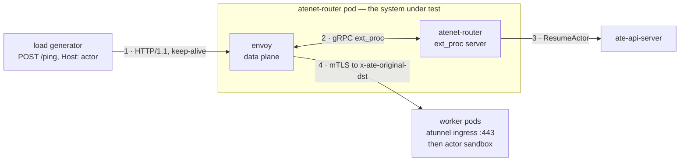
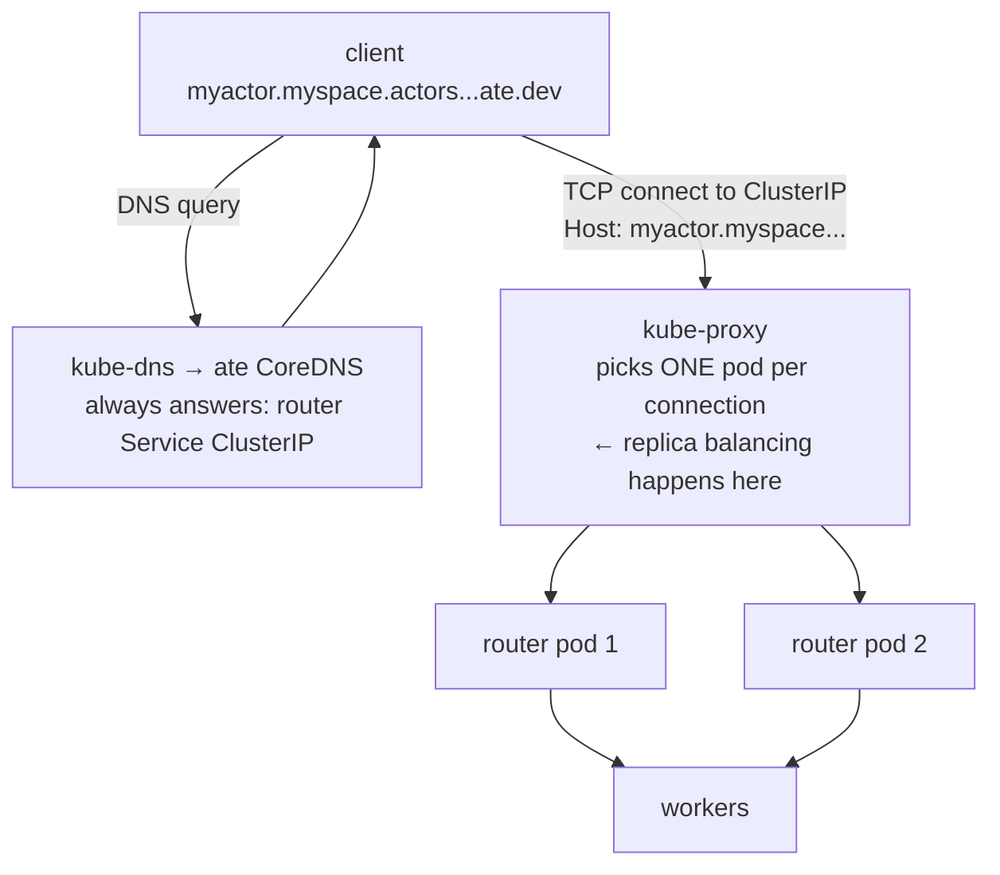

# routercap

Measures how much load one `atenet-router` pod absorbs before it stops
absorbing, and what the failure looks like when it does. One run measures one
Envoy CPU limit and produces one file, `stats.jsonl`: a time series, one line
per measurement window. The harness does not render anything — plotting and
comparison live in whatever reads the series. The findings from the shipped
sweeps are in [RESULTS.md](RESULTS.md).

## Why this test exists

Every actor request goes through `atenet-router`, and nobody had measured
what one pod can take. Without that figure there is no basis for the replica
count, for the CPU limits in
[atenet-router.yaml](../../manifests/ate-install/atenet-router.yaml), or for
an alert threshold — and no way to tell a regression from a busier week.

A single "N QPS" number would not settle it either. What matters is the shape
at the edge: whether throughput plateaus or collapses, whether latency
degrades or cliffs, and whether the binding constraint is CPU at all. So the
harness walks a rising load ladder and records the whole curve. Comparing CPU
limits means running it once per limit and reading the files side by side.

### Why not locust

Locust-style load tests are closed-loop: each simulated user sends a request,
waits for the reply, then sends the next. The moment the router slows down,
the users slow down with it — offered load sags exactly when the system is
most interesting, and the latency samples miss the worst moments because
fewer requests were in flight during them. The literature calls this
coordinated omission. A closed-loop test of this router would report a
flattering curve that bends where the client throttled, not where the router
failed.

This harness is open-loop: a pacer fires requests on a fixed schedule whether
or not earlier ones have returned, so offered load stays the independent
variable all the way through a collapse. The repo's boomer/locust rig
(`cmd/benchmarking/boomer-glutton`) remains the right tool for
workload-shaped soak tests; it is the wrong instrument for finding a wall.

## What this measures

`atenet-router` is one pod with two containers. `envoy` is the data plane.
`atenet-router` is a Go sidecar acting as Envoy's ext_proc server: it
decides, per request, which worker the actor is on and resumes it if it is
not running.



Envoy holds the request open across step 2, so every in-flight request
occupies one ext_proc slot and, at step 4, one upstream connection and one
source port. That is why concurrency is a measured series and not an
afterthought.

### The latency

End-to-end client-observed latency of one `/ping` request, timed from when
the pacer scheduled it to be sent — not from when it left the socket.
Concretely, the clock covers, in order:

* any wait inside the generator (the request was due but blocked: no idle
  connection, dial in progress). This wait is counted on purpose: at load it
  usually means the router has not answered the requests already on the
  connections, and a real client's request queues in its own pool the same
  way,
* the TCP/TLS dial if a fresh connection was needed,
* Envoy's handling, the ext_proc call to the sidecar (warm actor resume
  included), the round trip to the worker,
* the response coming back and being read.

Starting the clock at the scheduled time avoids coordinated omission, the
standard way load tests lie: a clock that starts at the actual send never
measures a stall, because nothing is sent during one. Here, a request that
was due while the router stalled carries the whole stall in its latency.
Timeouts count their full elapsed time instead of vanishing, and percentiles
are computed from raw per-request samples, not histogram estimates.

## What this doesn't measure

**Cold actor starts.** Every actor is created and resumed before the ladder
begins; a cold resume takes ~3.8 s and would otherwise land inside the first
rung as router latency. The warm per-request control-plane lookup stays in
the path (it is part of every real request) and is reported separately as
`span_resume_ms` — 0.7-1.5 ms in healthy windows.

**DNS and kube-proxy.** In production a client resolves the actor's hostname
through ate's CoreDNS (which always answers with the router Service's
ClusterIP) and kube-proxy picks a router pod per TCP connection. This harness
dials one router pod's IP directly, skipping both hops, so a wall indicts
Envoy with zero doubt — not conntrack, not kube-dns, not a NAT rule. What the
skipped hops would add is small and knowable (a per-connection DNAT costing
microseconds, a DNS lookup per dial); what they would cost the measurement is
attribution.



**More than one replica.** The run pins the Deployment to a single pod. A
number for N replicas is this number times N only if kube-proxy spreads
connections evenly and nothing shared behind the router binds first, and
neither is something this rig can tell you.

## What this produces

One file per run, `stats.jsonl`, one JSON object per measurement window,
flat. Flat because the tools that plot it are not this repo's, and a nested
record makes every one of them write a walker. The window is cAdvisor's, so
each line covers ~10 s and every number on it — CPU, memory, Envoy deltas,
latency percentiles — is computed over exactly that interval.

Three keys are the envelope, identifying the run rather than measuring it:

| Key | What it is |
|---|---|
| `timestamp` | the window's closing instant, so a series never claims a measurement before it was taken |
| `tag` | the commit the generator was built from, `-dirty` if the tree was |
| `test_name` | the run's name, `routercap` unless `--name` says otherwise |

The rest is the measurement. `cpu_limit_cores` is constant across a file — it
is what distinguishes two files — and `rung` is `-1` for a window that fell
outside any rung:

| Keys | What they are |
|---|---|
| `cpu_limit_cores`, `rung`, `rung_qps`, `warmup`, `window_seconds` | which rung this window belongs to and whether it is inside that rung's discarded head |
| `offered_qps` | the pacer's *schedule*, not a count of what was emitted, so a struggling generator cannot redefine the x-axis |
| `achieved_qps`, `success_qps` | what came back, and what came back with a 2xx |
| `latency_p50_ms`, `latency_p95_ms`, `latency_mean_ms` | client-observed, from scheduled send |
| `in_flight_max`, `dispatch_lag_p95_ms` | concurrency peak, and the generator measuring its own scheduled-to-wire delay |
| `client_connections`, `client_new_connections`, `client_requests_per_connection` | the generator's pool; a step here marks a window where a stall made it dial thousands of fresh connections. `client_requests_per_connection` counts against connections opened *in that window*, so it is **absent, not zero**, in the ordinary case where the pool opened none and every request reused an existing one |
| `envoy_cpu_cores`, `sidecar_cpu_cores`, `envoy_memory_bytes`, `sidecar_memory_bytes` | the two containers separately. **Absent, not zero,** when cAdvisor did not report that container in that window |
| `span_before_envoy_ms`, `span_envoy_ms`, `span_sidecar_ms`, `span_worker_ms`, `span_total_ms` | the mean request split across the hops it passed through; the first four sum to the total |
| `span_resume_ms` | the control-plane round trip *inside* the sidecar hop, so not one of the four |
| `span_count_spread`, `span_resolution_share` | how much to trust that split (below) |
| `guards`, `guard_fatal` | rig guards that tripped on this window, and the one that ended the run |

`summary.json` sits next to it: per-rung aggregates and one sustainable-QPS
figure, written by `summarize.py`. It is a convenience for a human opening
the directory. Nothing reads it, its failure never changes the run's exit
code, and it can be regenerated from `stats.jsonl` at any time — including
for a run whose cluster is long gone.

A `job.yaml` (the rendered manifest) and `job.log` (the generator's stderr)
survive only when the run did not exit clean, which is when someone will want
them.

### Reading the per-hop split

Each window's mean request divides into four spans that do not overlap and
sum to the whole:

```
100% ┌────────────────┐ ─┐                    ─┐
     │   worker leg   │  │ measured:           │
     ├────────────────┤  │ upstream_rq_time    │
     │    sidecar     │  │ measured:           ├─ in-Envoy time
     ├────────────────┤  │ route.duration      │  (downstream_rq_time,
     │  Envoy itself  │  │ residual            │   measured)
     ├────────────────┤ ─┘                    ─┘
     │  before Envoy  │    residual  ←  the rig's share: generator
  0% └────────────────┘               queueing plus the dial
        one window's mean request = 100%
```

Two things bound how far this can be read. The spans are means, not
percentiles — percentiles do not decompose across hops, so there is no p95
version of this split and asking for one is a category error. And the two
quality markers say when even the means are noise: `span_count_spread` above
~0.1 means the four instruments disagreed about how many requests they saw,
and `span_resolution_share` above ~0.05 means Envoy's whole-millisecond
histogram rounding is a large fraction of the total, which is most healthy
windows. The split is for reading collapses.

### Sustainable QPS

`summarize.py` reports one figure, and it means exactly this: the highest
rung where, over that rung's non-warmup windows, achieved QPS was at least
99% of the rung's nominal rate, successful QPS was at least 99% of that rate,
and no single window's p50 exceeded 100 ms. Every rung is tested rather than
stopping at the first failure — a rung can fail on a transient and the ladder
recover above it — and the value reported is the rung's nominal rate, because
that is the rate the router was asked to sustain.

The nominal rate, not offered QPS, is deliberately the denominator. Achieved
tracks offered almost exactly, so measuring one against the other passes
every rung by construction — including a rung the run ended in the middle of,
whose final window carries a fraction of the traffic and which was therefore
never served at its nominal rate at all.

## Methodology

### Load generation

The pacer fires on a fixed tick. The generator measures itself: dispatch lag
(scheduled vs actual send) near zero means the x-axis is real. The transport
dials without a per-host cap on purpose — a cap would queue requests
internally, which is a closed loop wearing an open loop's clothes; the pool
size is recorded instead. The default ladder is 16 rungs, +1,000 QPS each,
45 s per rung with the first 10 s marked warmup so no measured window blends
a rung's ramp with its steady state. Load spreads over one pre-warmed actor
per worker pod.

Six guards separate "the rig ran out" from "the router ran out": generator
CPU, dispatch lag, client keep-alive, client port headroom, per-worker
connection rate, and control-plane throttling. A fatal trip ends the run and
exits 3, rig-limited — the windows below the trip still stand. Thresholds and
reasoning are in
[guards.go](../../internal/benchmarking/routercap/guards.go). Envoy's own
port-exhaustion and breaker counters are deliberately data, not guards — that
cliff is what the run came to measure.

### Envoy's worker threads

The router manifest passes `--cpuset-threads` and no `--concurrency`. That
combination is what makes Envoy 1.37 and later size the worker thread pool
from the container's cgroup CPU limit, which is the whole point of varying
that limit: the run is labelled with a number that actually shaped the proxy.

The flag is misleadingly named. It does not only read cpusets: it switches
the default from `std::thread::hardware_concurrency()` to
`min(node threads, CPU affinity, cgroup CPU limit)`, and the cgroup term is
reachable from nowhere else. Without it a CPU-limited Envoy still starts one
worker per node core. (`ENVOY_CGROUP_CPU_DETECTION=false` disables just the
cgroup term; it is not needed here and nothing sets it.)

`run.sh` refuses to patch a Deployment whose envoy container gets this wrong
in either direction — `--concurrency` present, or `--cpuset-threads` absent.
Belt and braces, the generator scrapes `envoy_server_concurrency` back at
startup and refuses to run if it does not match the limit, which is what
sizing threads from the node's 88 cores looks like: CFS throttling measured
instead of the proxy.

### Data collection

CPU and memory come from cAdvisor on the kubelet — the only source with raw
cumulative counters, CFS accounting and a per-container timestamp together
(Envoy exports no process CPU counter; `metrics.k8s.io` pre-averages over a
window it picks). The sampler runs off cAdvisor's clock: it polls until the
router container's timestamp advances, and every number in a record is
computed over exactly that `[t0, t1)` interval. The ~10 s that costs is the
honest resolution of any container CPU figure on a kubelet-managed node. The
full argument is at the top of
[cadvisor.go](../../internal/benchmarking/routercap/cadvisor.go).

### Cluster setup, and why

`provision.sh` builds a dedicated cluster, `substrate-routercap`, with four
tainted node pools plus GKE's small untainted `default-pool`:

| Pool | Nodes (default) | Runs |
|---|---|---|
| `router` | 1 × `c3-standard-88` | `atenet-router`, alone |
| `workers` | 2 × `c3-standard-88` | worker pods (the shipped runs used 4 nodes / 200 pods) |
| `loadgen` | 1 × `c3-standard-88` | the generator, alone |
| `system` | 1 × `c3-standard-88` | api-server, controller, dns, valkey |
| `default-pool` | 1 × `e2-standard-8` | GKE addons only |

The isolation that matters is the node, not the QoS class. Only the router
containers get explicit CPU limits, because Envoy's limit is the variable
under test. A CPU limit is CFS quota, and quota does not partition the things
that bite at this scale — NIC queues, conntrack, L3, memory bandwidth — which
are all per node. The router node stays at 88 cores whatever the run asks
for: the CPU limit should be the only thing constraining Envoy. `provision.sh`
asserts the node fits `ROUTERCAP_MAX_CPU_LIMIT` (64) alongside the sidecar,
and `run.sh` refuses a larger `--cpu-limit` rather than launching a run whose
router pod sits Pending.

The two halves of that setup — creating the pools (`pools.sh`) and putting
`ate-system` on them (`placement.sh`) — are separate scripts because
`provision.sh` is not their only caller. See [Running from
CI](#running-from-ci).

### Layout

| Path | What it is |
|---|---|
| `benchmarking/routercap/provision.sh` | one-shot cluster build |
| `benchmarking/routercap/pools.sh` | ensures the tainted node pools exist; idempotent, and takes a subset |
| `benchmarking/routercap/placement.sh` | pins `ate-system` onto those pools and lets `atelet` past their taints |
| `benchmarking/routercap/run.sh` | one run: patches the router to the CPU limit, launches the generator Job, demuxes its output into the run directory |
| `benchmarking/routercap/common.sh` | shared config and helpers for the scripts |
| `benchmarking/routercap/demux.py` | splits the Job's merged log stream into `stats.jsonl` (tagged records) and `job.log` (everything else) |
| `benchmarking/routercap/summarize.py` | `stats.jsonl` → `summary.json`; no rendering |
| `benchmarking/routercap/manifests/` | the generator Job template and its RBAC |
| `benchmarking/routercap/runs/` | one directory per run, never committed |
| `cmd/benchmarking/routercap/` | the generator binary |
| `internal/benchmarking/routercap/` | the library: pacer, sender, actor pool, cAdvisor windows, Envoy/sidecar scrapers, span math, guards, records |

### Exit codes

`run.sh` exits with the generator's own status, because "the Job failed"
discards the only bit that says whether the data is usable:

| Code | Meaning |
|---|---|
| 0 | clean |
| 1 | failed |
| 2 | interrupted |
| 3 | rig-limited — the rig ran out before the router did; the windows up to the trip stand |
| 4 | preflight or provisioning |

0 and 3 both mean a run produced data worth keeping. Anything else does not.

## How to reproduce

### Prerequisites

<details>
<summary>What you need before starting</summary>

* `gcloud` authenticated against a project that can create GKE clusters and
  `c3-standard-88` nodes in `us-central1-a`.
* The environment configuration sourced first (`source .ate-dev-env.sh`)
  so `PROJECT_ID`, `KO_DOCKER_REPO`, etc. are set.
* `kubectl`, `ko` (via `hack/run-tool.sh`) and `python3` on the path.

</details>

### Step 1: provision the cluster

* Creates the `substrate-routercap` cluster with its tainted node pools.
* Installs the substrate control plane.
* Applies the worker pool: one worker pod per replica on the worker nodes.
* Pins each component to its pool.

```bash
benchmarking/routercap/provision.sh
```

### Step 2: smoke-test the rig

* Runs 2 actors and 3 short rungs. Measures nothing.
* Proves the wiring: the router patch takes, the Job launches, the scrapes
  and cAdvisor windows fill, and the run directory lands.

```bash
benchmarking/routercap/run.sh --smoke
```

### Step 3: measure

* Patches the router to the CPU limit under test, which restarts the pod.
* Purges any actors an earlier run left behind, then creates and
  warm-resumes one actor per worker pod.
* Walks the ladder and writes `runs/<timestamp>/stats.jsonl`.

```bash
benchmarking/routercap/run.sh --cpu-limit 4
```

A sweep is that command once per CPU limit, each into its own output
directory. Separate invocations rather than a loop inside the script: it is
what lets each one be a separate CI entry that can fail, be retried, or be
compared on its own.

### Step 4: re-summarize (optional)

```bash
python3 benchmarking/routercap/summarize.py runs/<timestamp>/stats.jsonl
```

### Step 5: tear down

* Deletes the cluster directly.
* Do not use `hack/teardown.sh`: it targets your dev cluster and revokes
  project-level IAM shared with every other cluster in the project.

```bash
gcloud container clusters delete substrate-routercap \
  --location=us-central1-a --project="${PROJECT_ID}" --quiet
```

## Running from CI

[benchmarking/automation](../automation) can run this on a schedule. An entry
in its `tests.yaml` with `kind: routercap` takes `cpuLimit`, `actors` and
`rungs`, and the orchestrator turns it into one `run.sh` invocation:

```yaml
- name: routercap_4_cores
  kind: routercap
  targetCluster: dev
  cpuLimit: 4
  actors: 100
  rungs: 16
```

Two things differ from a hand-run ladder.

**It runs on a shared cluster, not `substrate-routercap`.** The orchestrator
calls `pools.sh --pools router,loadgen`, so the target cluster gets two of the
four pools: the router and the generator each get a node to themselves, and
everything else — api-server, valkey, the actors — stays wherever the cluster
already put it. That is weaker isolation than `provision.sh` builds, and the
tradeoff is deliberate: those two pools are what the measurement depends on,
and the pools are never deleted, so each one is a standing bill. `placement.sh
--pools router,loadgen` then pins `atenet-router` and lets `atelet` past the
taints.

**Nothing runs the ladder twice.** One entry is one CPU limit, so a sweep is
several entries, each free to fail or be retried on its own. `--name` puts the
entry's name in every record's `test_name`, which is what separates one
entry's series from another's once they share a table.

The orchestrator maps the exit codes above onto a test status: 0 and 3 are
complete, everything else fails, and a run that exits clean but writes no
`stats.jsonl` fails anyway. It uploads `stats.jsonl` and `summary.json` itself,
to the GCS layout `benchmarking/locust/runner.py` uses — the generator Job is
distroless and read-only and cannot upload its own. See the [automation
README](../automation/README.md#routercap-prerequisites) for the IAM that
needs.
